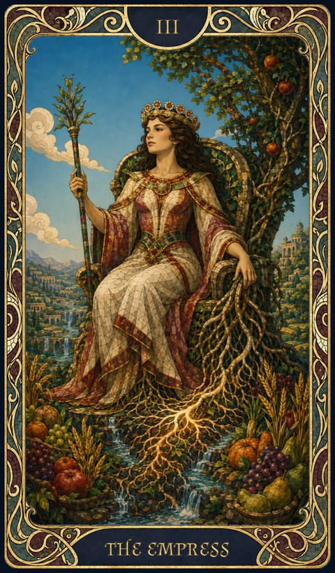

# III. The Empress

{ .fh-card-illus }

- **Meaning** — fertility, abundance, growth, prosperity. Support, harmony, generosity.
- **Signature Ability** — Constitution
- **Destiny Impact** — +2
- **Power** — recover an additional Destiny Point after a long rest if you have 2 or less.

#### Vibrations of The Empress { .fh-clear }

| Rank (vp) | Vibration | Effect |
| --- | --- | --- |
| 1 | **Nurturing Touch** | touch: a creature regains 1d4+1 HP |
| 2 | **Mother's Mending** | *Cure Wounds* |
| 3 | **Bountiful Aid** | *Aid* |
| 4 | **Verdant Embrace** | 1 min: allies who start their turn within 10 ft of you regain 1d4 HP |
| 5 | **Blessing of the Evergrowth** | 1 min: one creature regains 1d6 HP at the start of each of its turns |
| 6 | **The Empress's Garden** | *Mass Cure Wounds* |
