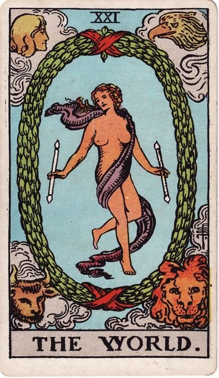

# XXI. The World

{ .fh-card-illus }

- **Meaning** — accomplishment, wholeness, unity. The end of one cycle, opening to a new beginning.
- **Signature Ability** — Constitution
- **Destiny Impact** — +1
- **Power** — after a long rest, restore one Destiny Point to group members excluding yourself. Roll a die of your choice: - 1d4 for 1 to 4 people - 1d6 for 5 to 6 people - 1d8 for 7 to 8 people - 1d10 for 9 to 10 people - 1d12 for 11 to 12 people You pay the price rolled by your die.

### Vibrations of The World { .fh-clear }

| Rank (vp) | Vibration | Effect |
| --- | --- | --- |
| 1 | **Well-Rounded** | advantage on one check with a skill you lack proficiency in |
| 2 | **Every Tongue** | *Comprehend Languages* |
| 3 | **Wayfarer's Gift** | 1 h: swim and climb speeds, and you can breathe water |
| 4 | **The World Beneath** | 1 h: fly speed 30 ft |
| 5 | **The Four Corners** | *Conjure Minor Elementals* |
| 6 | **The Crown Traversed** | *Teleportation Circle* |

---

<nav class="fh-layer">

What Fate’s Hand does here

<ul>
<li>arcana adds 22 — Death, Judgement, Justice, Strength, Temperance, The Chariot…</li>
</ul>

Measured against the base game’s data. Rules this chapter states in its own words are not counted here.

</nav>
