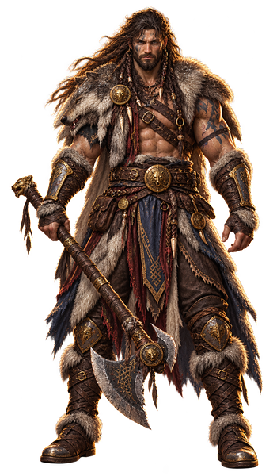
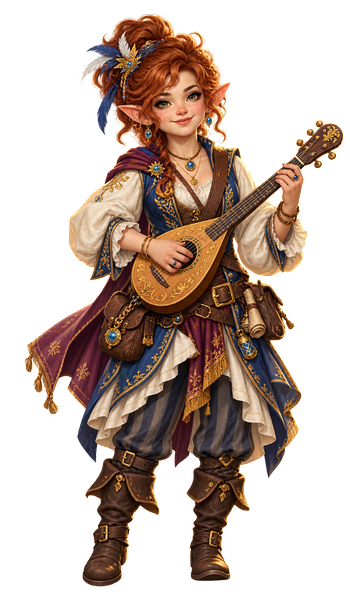
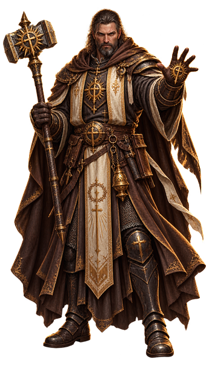
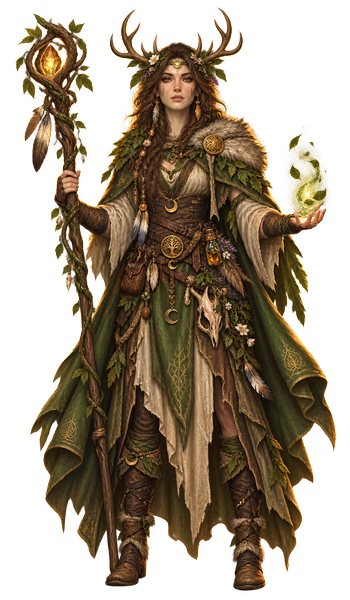
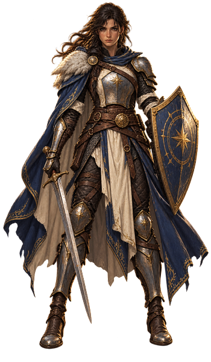
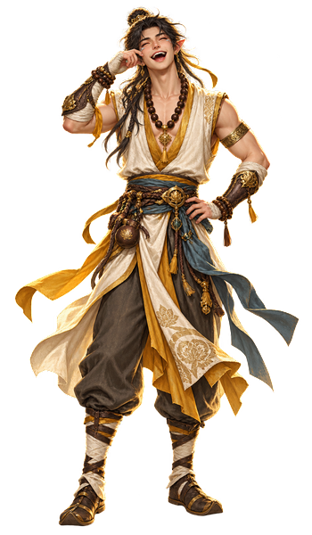
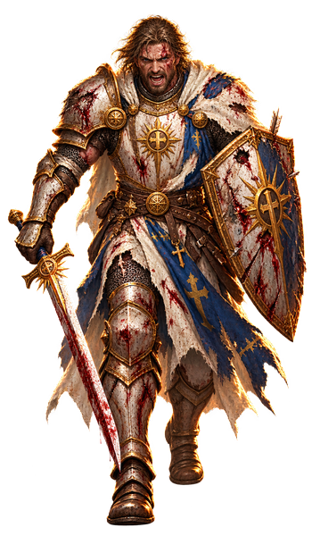
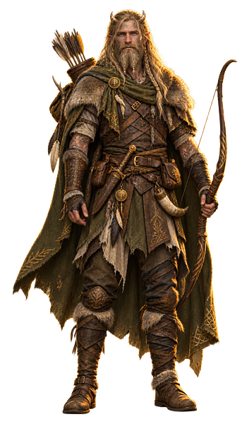
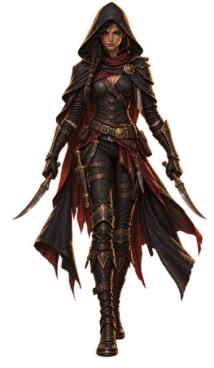

# Classes

<aside class="fh-translate">

Reading the quotations on this page

<ul>
<li><strong>Musical Instrument</strong> does not exist in Fate’s Hand — read one of <strong>Instrument (Strings)</strong>, <strong>(Wind)</strong> or <strong>(Other)</strong> — Fate’s Hand splits it in three, and each is bought separately.</li>
<li><strong>Perception</strong> does not exist in Fate’s Hand — read <strong>Vigilance</strong>, <strong>Delve</strong> or <strong>Survival</strong> — Fate’s Hand split it in three, and which one applies depends on what you are looking at.</li>
</ul>

The quotations below are the base game’s, word for word. We do not edit a quotation to fit our rules — we tell you how to read it.

</aside>

## Fate's Hand and the twelve classes

Each class below is printed **whole**: its base-game entry first, then what Fate's Hand hands
you on top. Where the two meet, Fate's Hand wins and the base-game line is not quoted at all —
you never have to hold two versions of the same rule in your head.

What Fate's Hand changes about a class is almost never a feature: it is the points the class
hands you, and where you are allowed to put them.

Your class no longer asks you to *"choose two skills"*. It hands you a budget, and you lay it
out yourself. Three numbers say what that budget is, and you only ever spend the third.

| | |
|---|---|
| **Bound skill points** | already placed on skills, inside your class list |
| **Bound tool points** | already placed on tools your class fixes |
| **Free point pool** | yours — spend on skills *or* tools, wherever you like |

Bound points are never in the free pool. They are spent before the sheet reaches you, and they
do not cross over: a bound tool point buys a tier on a tool and never on a skill. Only free
points move freely. How you spend any of them is in [Skills & Tools — Player Guide](skills-and-tools.md); what
each class carries is below, class by class.

### The tiers — one table, all twelve classes

| Tier | Cost |
|---|---|
| **Novice** | 1 point |
| **Adept** | 2 points |
| **Expert** | 4 points |

A point and a tier are the same thing: spending 4 on one skill *is* placing an **Expert**. No
class prices a tier differently, so this table is printed once and holds everywhere.

### The ladder — one line, all twelve classes

**+2 free points at levels 4 · 8 · 12 · 16 · 20**, counted on your character level.

You receive every step you have *passed through*, not only the last one: a character built
directly at level 9 holds the step at 4 and the step at 8. One class carries a second ladder
of its own — the Bard.

### Expertise access, and who opens it early

**Expert** may be bought from the level printed under your class. Nine of the twelve open it at
level 4. Three open it earlier, and each does so through a feature: Rogue at **lvl 1** · Bard at
**lvl 2** · Ranger at **lvl 2**.

A feature that grants Expertise never hands you an expertise. It hands you free points, plus
the permission to spend at **Expert** before level 4. Two gains, not one — and the permission
is half of what the feature is worth.

### The twelve, side by side

| Class | Bound skill | Bound tool | Free point pool | Expertise access |
|---|---|---|---|---|
| Barbarian | 2 | 0 | 10 | lvl 4 |
| Bard | 3 | 2 | 12 | **lvl 2** |
| Cleric | 2 | 0 | 10 | lvl 4 |
| Druid | 2 | 1 | 12 | lvl 4 |
| Fighter | 2 | 0 | 10 | lvl 4 |
| Monk | 2 | 0 | 10 | lvl 4 |
| Paladin | 2 | 0 | 10 | lvl 4 |
| Ranger | 3 | 0 | 12 | **lvl 2** |
| Rogue | 6 | 1 | 14 | **lvl 1** |
| Sorcerer | 2 | 0 | 10 | lvl 4 |
| Warlock | 2 | 0 | 10 | lvl 4 |
| Wizard | 2 | 0 | 10 | lvl 4 |

Your Inheritance's 6 free points are already counted in that pool. Your species, your Origin
Feat and your talents are not — they add on top. *(See [Inheritance](inheritance.md) and
[Skills & Tools — Player Guide](skills-and-tools.md).)*

### Class lists, and the one thing Fate's Hand rewrote

Six class lists differ from the base game's, for two distinct reasons.

**Five were rewritten because they named *Perception***, which Fate's Hand does not have:
**Delve**, **Vigilance** and **Survival** take its place — Barbarian, Druid, Fighter, Ranger and
Rogue.

**One was written outright.** The base game lets a bard pick from *any* skill; Fate's Hand names
the six a bard is trained in, and its three bound points are placed among those. It is the first
list decided rather than converted.

The remaining six stand as printed.

> ⏳ Those six are closed lists, and none of them reaches the nine skills Fate's Hand added. That
> is a fact, not a ruling: no one has yet decided whether a Wizard should reach *Academics*, or a
> Warlock *Streetwise*. When that is decided, it is decided here — the Bard shows the shape it
> would take.

### Each class, in full — and the two lines that are missing

Every section below opens with that class as the base game prints it: hit die, primary ability,
saving throws, what it is trained to wear and wield, what it starts with, and the features it
gains by level. What Fate's Hand hands you is printed straight after, in the same section.

> Two lines of each entry are deliberately missing, and it matters.
>
> **Its weapon mastery pool.** That one is real, and it is quoted in **Equipment** instead. A
> rule printed twice is a rule that will drift.
>
> **Its skill list.** The base game's version names *Perception*, which Fate's Hand does not
> have, and picks from eighteen skills where Fate's Hand has twenty-six. The list that counts is
> the one printed under your class, with the points that go on it.

Everything on this page that is **not** marked FH is the base game as printed. The
subclasses are the base game's, plus one: the **[Moonkeeper](moonkeeper.md)**, a Fate's Hand sorcerer
subclass.

## Barbarian

{ .fh-thumb }

Rage isn't losing control—it's the only control a barbarian trusts. Pain fades, caution burns away, and the body remembers a violence older than any drilled stance. They shrug off blows that would drop an armored knight, then hit back twice as hard. No spellbook, no oath: only fury, sharpened by every fight survived.

[Read the full entry →](classes/barbarian.md)

## Bard

{ .fh-thumb }

A bard bets a song can do what a sword can't, and wins more than skeptics expect. Charisma isn't decoration here—it's the power source, drawn from music, wit, and nerve rather than study or scripture. They can talk down a guard, then fight the next one, barely noticing. Every performance is a small working of magic.

[Read the full entry →](classes/bard.md)

## Cleric

{ .fh-thumb }

A cleric's power isn't borrowed, it's granted—proof something answered the prayer. The bargain cuts both ways: healing in one hand, judgment in the other, and a debt of service that doesn't clock out after battle. Robes under armor, a holy symbol worth more than the sword. Private life is the calling's first casualty.

[Read the full entry →](classes/cleric.md)

## Druid

{ .fh-thumb }

A druid doesn't dominate nature, they petition it—and get answers more often than a king would like. Ask properly, and weather, root, even a wolf's own body can be borrowed a while; the oldest barely bother turning back. Kingdoms trust borders. A druid was loyal to the ground before any line got drawn.

[Read the full entry →](classes/druid.md)

## Fighter

{ .fh-thumb }

Steel remembers what flesh forgets. Ten thousand strikes forge it. No spellbook, no arcane grammar—only muscle and discipline. They are the wall that never breaks. Armor is their skin; courage is the spell. Knight, duelist, veteran—all built by practice, not birth. When magic fails, steel remains.

[Read the full entry →](classes/fighter.md)

## Monk

{ .fh-thumb }

A monk spent years turning an empty hand into a weapon nobody had to hand them, and their own body into armor nobody had to forge. Somewhere in there they learn to catch a blow mid-flight and send it back. No steel, no plate: just discipline, repeated past where most people quit and call it enough.

[Read the full entry →](classes/monk.md)

## Paladin

{ .fh-thumb }

A paladin's magic comes with strings attached—one oath, sworn once, that the power keeps checking against. Keep it, and the strength holds; bend it for convenience, and the paladin feels it first. They walk into fights cautious people avoid, healing hands as practiced as the blade. The oath is the whole engine.

[Read the full entry →](classes/paladin.md)

## Ranger

{ .fh-thumb }

A ranger notices what the ground is trying to hide—a bent stalk, a wrong print, weather an hour before anyone else smells it. Half warrior, half quiet spellcaster, most dangerous at home, oddly at ease around animals that would bolt from anyone else. Rangers walk point, and everyone follows the boot prints.

[Read the full entry →](classes/ranger.md)

## Rogue

{ .fh-thumb }

A rogue doesn't overpower a fight, they end it early—one clean opening turns an ordinary hit into the only hit that mattered. That same eye for the gap shows up in a lock, a lie, a guard's blind spot. Jack of a dozen trades and better at leaving unseen, a rogue survives on a second way out already scouted.

[Read the full entry →](classes/rogue.md)

## Sorcerer

{ .fh-thumb }

A sorcerer's magic showed up before any teacher could claim credit—inherited, inborn, or triggered by something that only happened once. It answers to instinct more than study: faster to reach for than a wizard's spell, harder to leash even after years of aiming it. Ask how it works and watch them shrug: it just does.

[Read the full entry →](classes/sorcerer.md)

## Warlock

{ .fh-thumb }

Somewhere past the ordinary rules of magic sits a warlock's patron; what that deal cost is nobody else's business. Invocations are doors that shouldn't exist, forced open once and left unlocked—no study, just payment made. The fine print stays private. What shows is the confidence of someone who no longer asks.

[Read the full entry →](classes/warlock.md)

## Wizard

{ .fh-thumb }

Weavers of arcane grammar, wizards bend reality through study, not birth. Spellbooks hold their power—lost pages mean lost magic. They shape fire, bend time, pierce minds, through relentless intellect. Fragile in armor, mighty in will, they trade strength for the universe's deepest secrets, one spell slot at a time.

[Read the full entry →](classes/wizard.md)

---

<nav class="fh-layer">

What Fate’s Hand does here

<ul>
<li>class changes 12 — Barbarian, Bard, Cleric, Druid, Fighter, Monk…</li>
<li>class progression no record differs</li>
</ul>

Measured against the base game’s data. Rules this chapter states in its own words are not counted here.

</nav>
