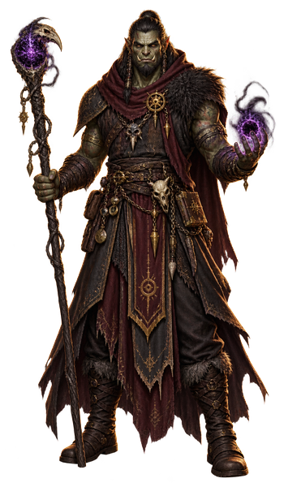

# Warlock

Somewhere past the ordinary rules of magic sits a warlock's patron; what that deal cost is nobody else's business. Invocations are doors that shouldn't exist, forced open once and left unlocked—no study, just payment made. The fine print stays private. What shows is the confidence of someone who no longer asks.

{ .fh-pcfh-art }

<!-- GENERATED — SRD 84bc651f48a7c1dd0077f076cd35bf73 + fh-skills. Ne pas éditer. -->

<dl class="fh-pcfh__id">
<dt>Hit die</dt><dd>D8 per Warlock level</dd>
<dt>Primary ability</dt><dd>Charisma</dd>
<dt>Saving throws</dt><dd>Wisdom, Charisma</dd>
<dt>Armor training</dt><dd>Light armor</dd>
<dt>Weapons</dt><dd>Simple weapons</dd>
<dt>Starting equipment</dt><dd>Choose A or B: (A) Leather Armor, Sickle, 2 Daggers, Arcane Focus (orb), Book (occult lore), Scholar’s Pack, and 15 GP; or (B) 100 GP</dd>
</dl>
<table class="fh-pcfh__table" id="progression"><thead>
<tr>
<th rowspan="2">Level</th>
<th rowspan="2">Proficiency Bonus</th>
<th rowspan="2">Class Features</th>
<th rowspan="2">Eldritch Invocations</th>
<th rowspan="2">Cantrips</th>
<th rowspan="2">Prepared Spells</th>
<th rowspan="2">Spell Slots</th>
<th rowspan="2">Slot Level</th>
<th colspan="3" class="fh-pcfh__group fh">Skill Points</th>
</tr><tr>
<th class="fh">Free Points</th>
<th class="fh">Bound Skills</th>
<th class="fh">Bound Tools</th>
</tr></thead><tbody>
<tr><td>1</td><td>+2</td><td class="fh-pcfh__feat"><a class="fh-lien" href="#l1-eldritch-invocations">Eldritch Invocations</a>, <a class="fh-lien" href="#l1-pact-magic">Pact Magic</a></td><td>1</td><td>2</td><td>2</td><td>1</td><td>1</td><td>10</td><td>2</td><td>0</td></tr>
<tr><td>2</td><td>+2</td><td class="fh-pcfh__feat"><a class="fh-lien" href="#l2-magical-cunning">Magical Cunning</a></td><td>3</td><td>2</td><td>3</td><td>2</td><td>1</td><td>10</td><td>2</td><td>0</td></tr>
<tr><td>3</td><td>+2</td><td class="fh-pcfh__feat"><a class="fh-lien" href="#l3-warlock-subclass">Warlock Subclass</a></td><td>3</td><td>2</td><td>4</td><td>2</td><td>2</td><td>10</td><td>2</td><td>0</td></tr>
<tr><td>4</td><td>+2</td><td class="fh-pcfh__feat"><a class="fh-lien" href="#l4-ability-score-improvement">Ability Score Improvement</a></td><td>3</td><td>3</td><td>5</td><td>2</td><td>2</td><td>12</td><td>2</td><td>0</td></tr>
<tr><td>5</td><td>+3</td><td class="fh-pcfh__feat">—</td><td>5</td><td>3</td><td>6</td><td>2</td><td>3</td><td>12</td><td>2</td><td>0</td></tr>
<tr><td>6</td><td>+3</td><td class="fh-pcfh__feat">Subclass feature</td><td>5</td><td>3</td><td>7</td><td>2</td><td>3</td><td>12</td><td>2</td><td>0</td></tr>
<tr><td>7</td><td>+3</td><td class="fh-pcfh__feat">—</td><td>6</td><td>3</td><td>8</td><td>2</td><td>4</td><td>12</td><td>2</td><td>0</td></tr>
<tr><td>8</td><td>+3</td><td class="fh-pcfh__feat"><a class="fh-lien" href="#l4-ability-score-improvement">Ability Score Improvement</a></td><td>6</td><td>3</td><td>9</td><td>2</td><td>4</td><td>14</td><td>2</td><td>0</td></tr>
<tr><td>9</td><td>+4</td><td class="fh-pcfh__feat"><a class="fh-lien" href="#l9-contact-patron">Contact Patron</a></td><td>7</td><td>3</td><td>10</td><td>2</td><td>5</td><td>14</td><td>2</td><td>0</td></tr>
<tr><td>10</td><td>+4</td><td class="fh-pcfh__feat">Subclass feature</td><td>7</td><td>4</td><td>10</td><td>2</td><td>5</td><td>14</td><td>2</td><td>0</td></tr>
<tr><td>11</td><td>+4</td><td class="fh-pcfh__feat">Mystic Arcanum (level 6 spell)</td><td>7</td><td>4</td><td>11</td><td>3</td><td>5</td><td>14</td><td>2</td><td>0</td></tr>
<tr><td>12</td><td>+4</td><td class="fh-pcfh__feat"><a class="fh-lien" href="#l4-ability-score-improvement">Ability Score Improvement</a></td><td>8</td><td>4</td><td>11</td><td>3</td><td>5</td><td>16</td><td>2</td><td>0</td></tr>
<tr><td>13</td><td>+5</td><td class="fh-pcfh__feat">Mystic Arcanum (level 7 spell)</td><td>8</td><td>4</td><td>12</td><td>3</td><td>5</td><td>16</td><td>2</td><td>0</td></tr>
<tr><td>14</td><td>+5</td><td class="fh-pcfh__feat">Subclass feature</td><td>8</td><td>4</td><td>12</td><td>3</td><td>5</td><td>16</td><td>2</td><td>0</td></tr>
<tr><td>15</td><td>+5</td><td class="fh-pcfh__feat">Mystic Arcanum (level 8 spell)</td><td>9</td><td>4</td><td>13</td><td>3</td><td>5</td><td>16</td><td>2</td><td>0</td></tr>
<tr><td>16</td><td>+5</td><td class="fh-pcfh__feat"><a class="fh-lien" href="#l4-ability-score-improvement">Ability Score Improvement</a></td><td>9</td><td>4</td><td>13</td><td>3</td><td>5</td><td>18</td><td>2</td><td>0</td></tr>
<tr><td>17</td><td>+6</td><td class="fh-pcfh__feat">Mystic Arcanum (level 9 spell)</td><td>9</td><td>4</td><td>14</td><td>4</td><td>5</td><td>18</td><td>2</td><td>0</td></tr>
<tr><td>18</td><td>+6</td><td class="fh-pcfh__feat">—</td><td>10</td><td>4</td><td>14</td><td>4</td><td>5</td><td>18</td><td>2</td><td>0</td></tr>
<tr><td>19</td><td>+6</td><td class="fh-pcfh__feat"><a class="fh-lien" href="#l19-epic-boon">Epic Boon</a></td><td>10</td><td>4</td><td>15</td><td>4</td><td>5</td><td>18</td><td>2</td><td>0</td></tr>
<tr><td>20</td><td>+6</td><td class="fh-pcfh__feat"><a class="fh-lien" href="#l20-eldritch-master">Eldritch Master</a></td><td>10</td><td>4</td><td>15</td><td>4</td><td>5</td><td>20</td><td>2</td><td>0</td></tr>
</tbody></table>

The last three columns are Fate's Hand. They show your <b>running total</b> at that level, not the gain — you keep every step you passed through.

<h3 class="fh-pcfh__feature" id="l1-eldritch-invocations">Level 1: Eldritch Invocations</h3>

You have unearthed Eldritch Invocations, pieces of forbidden knowledge that imbue you with an abiding magical ability or other lessons. You gain one invocation of your choice, such as Pact of the Tome. Invocations are described in the “Eldritch Invocation Options” section later in this class’s description.

Prerequisites. If an invocation has a prerequisite, you must meet it to learn that invocation. For example, if an invocation requires you to be a level 5+ Warlock, you can select the invocation once you reach Warlock level 5.

Replacing and Gaining Invocations. Whenever you gain a Warlock level, you can replace one of your invocations with another one for which you qualify. You can’t replace an invocation if it’s a prerequisite for another invocation that you have.

When you gain certain Warlock levels, you gain more invocations of your choice, as shown in the Invocations column of the Warlock Features table.

You can’t pick the same invocation more than once unless its description says otherwise.

<h3 class="fh-pcfh__feature" id="l1-pact-magic">Level 1: Pact Magic</h3>

Through occult ceremony, you have formed a pact with a mysterious entity to gain magical powers. The entity is a voice in the shadows—its identity unclear—but its boon to you is concrete: the ability to cast spells. See “Spells” for the rules on spellcasting. The information below details how you use those rules with Warlock spells, which appear in the Warlock spell list later in the class’s description.

Cantrips. You know two Warlock cantrips of your choice. Eldritch Blast and Prestidigitation are recommended. Whenever you gain a Warlock level, you can replace one of your cantrips from this feature with another Warlock cantrip of your choice.

When you reach Warlock levels 4 and 10, you learn another Warlock cantrip of your choice, as shown in the Cantrips column of the Warlock Features table.

Spell Slots. The Warlock Features table shows how many spell slots you have to cast your Warlock spells of levels 1–5. The table also shows the level of those slots, all of which are the same level. You regain all expended Pact Magic spell slots when you finish a Short or Long Rest.

For example, when you’re a level 5 Warlock, you have two level 3 spell slots. To cast the level 1 spell Charm Person, you must spend one of those slots, and you cast it as a level 3 spell.

Prepared Spells of Level 1+. You prepare the list of level 1+ spells that are available for you to cast with this feature. To start, choose two level 1 Warlock spells. Charm Person and Hex are recommended.

The number of spells on your list increases as you gain Warlock levels, as shown in the Prepared Spells column of the Warlock Features table. Whenever that number increases, choose additional Warlock spells until the number of spells on your list matches the number in the table. The chosen spells must be of a level no higher than what’s shown in the table’s Slot Level column for your level. When you reach level 6, for example, you learn a new Warlock spell, which can be of levels 1–3.

If another Warlock feature gives you spells that you always have prepared, those spells don’t count against the number of spells you can prepare with this feature, but those spells otherwise count as Warlock spells for you.

Changing Your Prepared Spells. Whenever you gain a Warlock level, you can replace one spell on your list with another Warlock spell of an eligible level.

Spellcasting Ability. Charisma is the spellcasting ability for your Warlock spells.

Spellcasting Focus. You can use an Arcane Focus as a Spellcasting Focus for your Warlock spells.

<h3 class="fh-pcfh__feature" id="l2-magical-cunning">Level 2: Magical Cunning</h3>

You can perform an esoteric rite for 1 minute. At the end of it, you regain expended Pact Magic spell slots but no more than a number equal to half your maximum (round up). Once you use this feature, you can’t do so again until you finish a Long Rest.

<h3 class="fh-pcfh__feature" id="l3-warlock-subclass">Level 3: Warlock Subclass</h3>

You gain a Warlock subclass of your choice. The Fiend Patron subclass is detailed after this class’s description. A subclass is a specialization that grants you features at certain Warlock levels. For the rest of your career, you gain each of your subclass’s features that are of your Warlock level or lower.

<h3 class="fh-pcfh__feature" id="l4-ability-score-improvement">Level 4: Ability Score Improvement</h3>

You gain the Ability Score Improvement feat (see “Feats”) or another feat of your choice for which you qualify. You gain this feature again at Warlock levels 8, 12, and 16.

<h3 class="fh-pcfh__feature" id="l9-contact-patron">Level 9: Contact Patron</h3>

In the past, you usually contacted your patron through intermediaries. Now you can communicate directly; you always have the Contact Other Plane spell prepared. With this feature, you can cast the spell without expending a spell slot to contact your patron, and you automatically succeed on the spell’s saving throw.

Once you cast the spell with this feature, you can’t do so in this way again until you finish a Long Rest.

<h3 class="fh-pcfh__feature" id="l11-mystic-arcanum">Level 11: Mystic Arcanum</h3>

Your patron grants you a magical secret called an arcanum. Choose one level 6 Warlock spell as this arcanum.

You can cast your arcanum spell once without expending a spell slot, and you must finish a Long Rest before you can cast it in this way again.

As shown in the Warlock Features table, you gain another Warlock spell of your choice that can be cast in this way when you reach Warlock levels 13 (level 7 spell), 15 (level 8 spell), and 17 (level 9 spell). You regain all uses of your Mystic Arcanum when you finish a Long Rest.

Whenever you gain a Warlock level, you can replace one of your arcanum spells with another Warlock spell of the same level.

<h3 class="fh-pcfh__feature" id="l19-epic-boon">Level 19: Epic Boon</h3>

You gain an Epic Boon feat (see “Feats”) or another feat of your choice for which you qualify. Boon of Fate is recommended.

<h3 class="fh-pcfh__feature" id="l20-eldritch-master">Level 20: Eldritch Master</h3>

When you use your Magical Cunning feature, you regain all your expended Pact Magic spell slots.

<h3 class="fh-pcfh__subclass">Warlock subclass: Fiend Patron</h3>

Make a Deal with the Lower Planes

Your pact draws on the Lower Planes, the realms of perdition. You might forge a bargain with a demon lord, an archdevil, or another fiend that is especially mighty. That patron’s aims are evil—the corruption or destruction of all things, ultimately including you—and your path is defined by the extent to which you strive against those aims.

<h4 class="fh-pcfh__feature" id="l3-dark-one-s-blessing">Level 3: Dark One’s Blessing</h4>

When you reduce an enemy to 0 Hit Points, you gain Temporary Hit Points equal to your Charisma modifier plus your Warlock level (minimum of 1 Temporary Hit Point). You also gain this benefit if someone else reduces an enemy within 10 feet of you to 0 Hit Points.

<h4 class="fh-pcfh__feature" id="l3-fiend-spells">Level 3: Fiend Spells</h4>

The magic of your patron ensures you always have certain spells ready; when you reach a Warlock level specified in the Fiend Spells table, you thereafter always have the listed spells prepared.

Fiend Spells

Warlock Level Spells

3 Burning Hands, Command, Scorching Ray, Suggestion

5 Fireball, Stinking Cloud

7 Fire Shield, Wall of Fire

9 Geas, Insect Plague

<h4 class="fh-pcfh__feature" id="l6-dark-one-s-own-luck">Level 6: Dark One’s Own Luck</h4>

You can call on your fiendish patron to alter fate in your favor. When you make an ability check or a saving throw, you can use this feature to add 1d10 to your roll. You can do so after seeing the roll but before any of the roll’s effects occur.

You can use this feature a number of times equal to your Charisma modifier (minimum of once), but you can use it no more than once per roll. You regain all expended uses when you finish a Long Rest.

<h4 class="fh-pcfh__feature" id="l10-fiendish-resilience">Level 10: Fiendish Resilience</h4>

Choose one damage type, other than Force, whenever you finish a Short or Long Rest. You have Resistance to that damage type until you choose a different one with this feature.

<h4 class="fh-pcfh__feature" id="l14-hurl-through-hell">Level 14: Hurl Through Hell</h4>

Once per turn when you hit a creature with an attack roll, you can try to instantly transport the target through the Lower Planes. The target must succeed on a Charisma saving throw against your spell save DC, or the target disappears and hurtles through a nightmare landscape. The target takes 8d10 Psychic damage if it isn’t a Fiend, and it has the Incapacitated condition until the end of your next turn, when it returns to the space it previously occupied or the nearest unoccupied space.

Once you use this feature, you can’t use it again until you finish a Long Rest unless you expend a Pact Magic spell slot (no action required) to restore your use of it. Wizard

This work includes material from the System Reference Document 5.2.1 (“SRD 5.2.1”) by Wizards of the Coast LLC, available at https://www.dndbeyond.com/srd. The SRD 5.2.1 is licensed under the Creative Commons Attribution 4.0 International License, available at https://creativecommons.org/licenses/by/4.0/legalcode.

**What your class hands you** FH

| Bound skill | Bound tool | Free point pool | Expertise access |
|---|---|---|---|
| 2 | 0 | 10 | lvl 4 |

**Your class list** — Arcana · Deception · History · Intimidation · Investigation · Nature · Religion, as printed.

> [!note] What Fate's Hand adds to the Warlock
> - **Points** — 2 bound skill · 0 bound tool · 10 free · **Expertise access** lvl 4
> - **Gains by level** — +2 free points at levels 4 · 8 · 12 · 16 · 20
> - **List** — as printed
> - **Grants** — none; no Warlock feature hands out points or opens Expertise early
> - **Subclasses** — as printed
> - **Arbitrated** — nothing; every Warlock rule stands as printed

---

<nav class="fh-layer">

What Fate’s Hand does here

<ul>
<li>class changes 12 — Barbarian, Bard, Cleric, Druid, Fighter, Monk…</li>
<li>class progression no record differs</li>
</ul>

Measured against the base game’s data. Rules this chapter states in its own words are not counted here.

</nav>
