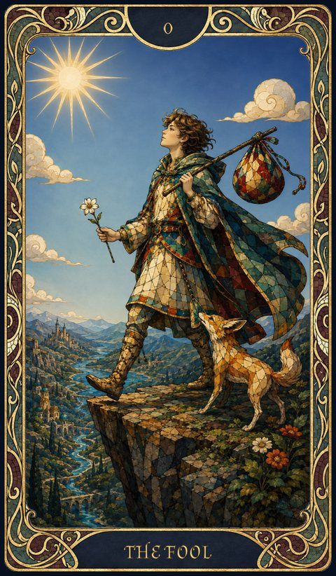
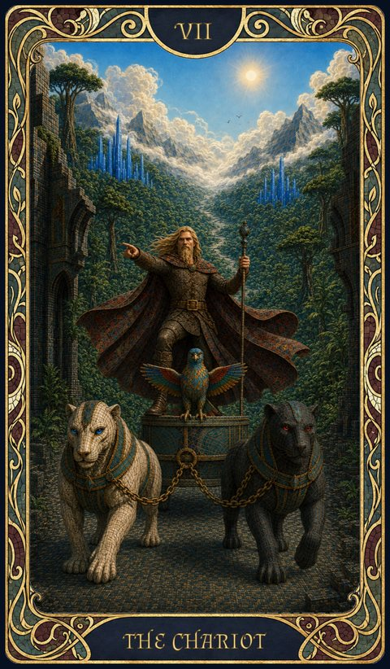
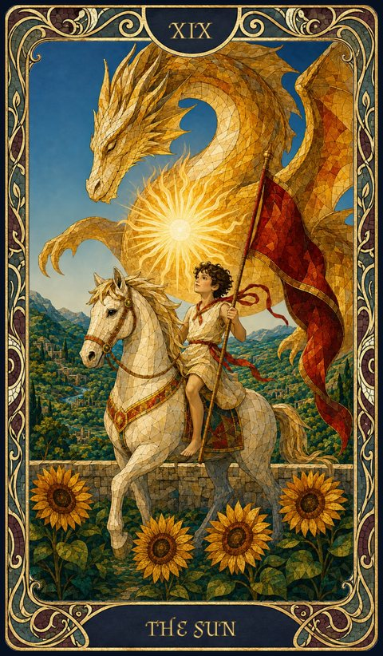

# Destiny System

---

Glimmers of true power flicker beyond mortal sight, revealing a grand tapestry of fate. Your **Destiny Score** is both compass and conduit. Every hero begins with a **Major Arcana**—an echo of cosmic authority. Wield these gifts wisely: the greater your strength grows, the more the universe may demand in return.

> "There are more worlds than you know. Tread carefully, lest you rouse the powers that shape them."

---

## 1. Destiny Score, Points & Dice

- **Destiny Score** — your **ceiling** (maximum). A measure of your cosmic significance.
- **Destiny Points** — your **current** value. Spent to fuel Destiny Dice; replenished on rest.
- **Destiny Dice** — d4 / d6 / d8 / d10 / d12, used to bend a roll (see §3).

### Calculating your Destiny Score
- **Proficiency** — add your proficiency bonus.
- **Innate** — species base (table below), your Inheritance, feats (e.g. *Auspicious*), and your Major Arcana.
- **Glory / Damnation** — deeds that shift your standing among hidden powers (honor raises it, villainy taints it).
- **Other** — a magic item, a boon, or some subclasses may also influence the score.

> *Example — Sir Gawain (5th-level Human Knight): proficiency +3, Human birthright +3, Auspicious +2, Arcana boon +1, chivalric deed +1 → **Destiny Score 10**.*

### Destiny Dice — slots & stacking
Each time your **Destiny Points** reach an **even** total, you gain a Destiny Die in the **lowest slot available** — d4 first, then d6, d8, d10, d12. Only once **all slots up to d12 are full** does the next even total start a **second round**: a 2nd d4, then a 2nd d6, and so on — so you can hold **several dice of the same size**.

Your Points go **up and down** in play, so there is no fixed link between a Points total and a die size — only the lowest empty slot matters. *You may wake up at 8 Points one morning and the first open slot is a d6.*

### Arcane Critical
A **max roll** on a Destiny Die (e.g. a 12 on a d12) is an **automatic Natural 20**, at a cost of only **−1 Destiny Point** — no Arcane Awakening.

### Species — Base Destiny

**Base Destiny is 2 for every species.** A handful get a dedicated **Destiny-chosen power** on top of that flat 2 — currently **Elf** (+2 to the Destiny pool), **Human** (+1 Destiny Point/day) and **Halfling** (advantage on Chaos rolls). No other species has one yet.

> *Full traits for each species: see [Species](species.md). The **Eluzi** (an ascended state, not a starting species) keep the Base Destiny of what they were. Older species (Aasimar, Half-Elf, Half-Orc, Eladrin, Firbolg): see the archive.*

---

## 2. Recovery & Erosion

- **Long rest:** regain **+1 Destiny Point** — capped at your Destiny Score.
- **Even total → die back:** each time your Points reach an even number, regain the **lowest missing** die.
- **Cap & overflow:** long rest and most recovery **cannot exceed your Score**. The exceptions — **Arcana cards** and **Natural 1s** — grant *temporary* points that **may push you above your Score**.
- **Natural 20 (on a d20):** −1 Destiny Point. If this brings you to **0**, trigger an **Arcane Awakening** (§5).
- **Natural 1 (on a d20):** either **Accept** (fail, +1 *temporary* point) **or Invoke Chaos** (Points → 0, the failure becomes a critical success, then roll **2d6** on the [Chaos Table](chaos-tables.md)).
- Other sources of temporary points: the **[Ceremony](https://www.dndbeyond.com/spells/14760-ceremony)** spell (once per long rest; better with a richer sacrifice), and **Minor Arcana** drawn on an Awakening.

> "When fortune smiles, it always demands a price. When it frowns, you must risk even more to survive."

---

## 3. Using Destiny Dice

1. **Spend a die** — roll it; **subtract** the result from your Destiny Points and **add** it to a d20 check (attack, skill, or save).
2. **Breach 0** — if your Points reach **0 or below**, provoke **Chaos** (§4).
3. **Max roll = Critical Success** — counts as a Natural 20; you lose only **−1 Point** (not the full roll) and the die is spent until recovered.
4. **Roll of 1 = Arcane Critical Failure — or a refusal.** A 1 on a Destiny Die is an offer, exactly as a Natural 1 on a d20 is (§2). Choose:
    - **Accept** — the check fails critically; you gain **+1 Destiny Point** but **lose that die**. *(That +1 often lands you on an even total, which immediately regains the lowest missing die — so roughly one time in two you get a die straight back.)*
    - **Refuse** — the 1 reads instead as the die's **highest face**: an **Arcane Critical Success** (§1), counting as a Natural 20. The price is exactly what defying a Natural 1 costs — your **Points drop to 0** and you roll **2d6** on the [Chaos Table](chaos-tables.md) for the ability you were using. The die is spent either way, and refusing forfeits the +1 point along with any die it would have brought back.

> *Refusing is the mirror of §2's Natural 1: the same gesture, made from the other side. Fate offered you a way out of the failure it was about to hand you; taking it back costs everything you were holding.*

> *Example — Lirien (Points 6) attempts a wild acrobatic feat with a d6. She rolls 5: +5 to her check, dropping her to 1. She avoids Chaos (5 < 6), but one more push risks calamity.*

---

## 4. The Chaos Effect

Chaos occurs when spending a die brings your Destiny Points to **0 or below**.

1. **Overreach** — how far below 0 you land (Points 6, roll 8 → Overreach 2).
2. **Overreach Save** — save with the **same ability** vs **DC = 10 + Overreach**.
3. **Success** — suffer **1 level of Exhaustion**.
4. **Failure** — roll **1d6 + Overreach** on the [Chaos Table](chaos-tables.md) for that ability. The higher the result, the worse (injuries, lasting handicaps, madness tied to the ability used).

A **Natural 1** on a d20 may instead **force destiny** — turning the failure into a critical success (Natural 20) at the cost of a **2d6** [Chaos roll](chaos-tables.md). **Refusing an Arcane Critical Failure** (§3.4) costs the same 2d6, and likewise skips the Overreach save entirely: the two refusals go straight to the table.

### Exhaustion — house scale

The 5e ladder is not used here. Chaos hands out levels often enough that the official scale would end a character rather than mark one: by two levels you are already unplayable. Fate's Hand keeps the six levels and flattens what each one costs.

- **Six levels.** Each level is a flat **−1** to every d20 test — ability checks, attacks and saving throws alike. They stack, so level 3 is −3. **Level 6 is still death.**
- **No other penalty.** No halved speed, no halved hit point maximum, no disadvantage — the −1 is the whole of it.
- **Recovery.** A **long rest** always removes **1 level** of Exhaustion. A **short rest** may remove **1 additional level**, but only **once per day** — once between two long rests. The long rest is what makes a short rest able to heal again.

> *Example — Karnos ends a bad night at Exhaustion 3, taking −3 on everything. His long rest brings him to 2. Later that same day, a short rest after a hard fight brings him to 1 — his one short-rest recovery for the day. A second short rest does nothing until his next long rest resets it; his next long rest, whenever it comes, removes another level regardless.*

> *Example — Karnos (Points 4) hurls a d10 at a foe, rolling 9 → Overreach 5. He fails his Strength save (DC 15) and consults the [Chaos Table](chaos-tables.md#strength-str): a fractured arm robs half his strength, but his blow lands with earth-shattering force.*

---

## 5. Arcane Awakening

When your Destiny **Points reach 0 after a Natural 20**, draw a card from the tarot deck:

- **Minor Arcana** — gain **temporary Destiny Points equal to the card's value**, and a single **Brick** (§5.1). Numbered cards give their number (Ace = 1); **heads — Page, Knight, Queen, King — give 10**.
- **Major Arcana** — you gain **+1 to your maximum Destiny Score and 10 temporary Destiny Points** *either way*, then choose to **switch** to the new card (losing your old Arcana's powers for the new one's) or **keep** your current one. **Only one Major Arcana is ever active — powers never stack.**

> *Example — Alysandra (Points 1) lands a final strike with a Nat 20, draining her to 0 and sparking an Awakening. She draws **The Emperor**: her Score climbs and she gains command over lesser minds.*

### 5.2 What a Major Arcana is

Twenty-two cards, and each one is a **person your fate could turn out to be**.
A card is never just a bonus: it carries a **meaning**, it moves your Destiny
Score, it grants a **power** you may use, and it leaves a **vibration** — a way
the world answers you.

⭐ **You meet them one at a time.** There is no list to study before you play:
you learn a card by **drawing** it, and what you draw is yours for good. Three
are shown below so you know what a card looks like — the other nineteen are
waiting.

<figure class="fh-arcana-card">

<figcaption>0 The Fool</figcaption>
<dl>
<dt>Meaning</dt><dd>innocence, beginnings, carefreeness, freedom. Unlimited potential, stepping into the unknown without fear. Exploration without attachments, trust in chance.</dd>
<dt>Impact</dt><dd>+2</dd>
<dt>Power</dt><dd>once per long rest, you may roll 2 Destiny dice at once, take the total of both as a bonus, and pay only the price of the highest.</dd>
<dt>Vibration</dt><dd>luck effect (Bless or Guidance depending on level).</dd>
</dl></figure>
<figure class="fh-arcana-card">

<figcaption>VII The Chariot</figcaption>
<dl>
<dt>Meaning</dt><dd>victory, determination, triumph. Active control, moving toward success.</dd>
<dt>Impact</dt><dd>+1</dd>
<dt>Power</dt><dd>once per long rest, you have advantage on a Destiny die. Choose either the lowest or the highest.</dd>
<dt>Vibration</dt><dd>acceleration (Longstrider, Expeditious Retreat).</dd>
</dl></figure>
<figure class="fh-arcana-card">

<figcaption>XIX The Sun</figcaption>
<dl>
<dt>Meaning</dt><dd>success, vitality, clarity, joy. Dispels shadows, brings optimism and truth.</dd>
<dt>Impact</dt><dd>+1</dd>
<dt>Power</dt><dd>once per short rest, add +2 to the result of a Destiny die without any additional cost.</dd>
<dt>Vibration</dt><dd>minor light and healing (e.g. Light + small heal).</dd>
</dl></figure>

*The reading of all twenty-two belongs to your Game Master.*

---

### 5.1 The Brick — dreaming something into being

A **Brick** is not a power. It is **a roleplay opportunity**: the chance to dream
something into reality. It has **no objective, no statistics and no cost** — and
the table should not go looking for any.

**How it is given.** When you draw a Minor Arcana, the GM hands you a Brick with
these words, and no others:

> *Dream something. Tie it to your character's background and their aspirations.
> You will incept it — but you will not control it.*

**What you owe.** A **written story**, composed by the player, on the **theme of
the Minor Arcana you drew**. Its suit and its number colour the dream; they do not
constrain it. There is no length requirement and no deadline — only that it be
written, and be yours.

**What it costs you.** Nothing in points. But the dream **marks you**: it surfaces
as **tattoos across your body**, in the imagery of the story you told. You did not
choose them and you cannot remove them.

**What it does to you.** You feel **the urge to tell the story** — because the
dream is *so real*. Not a compulsion the GM enforces with a save; a pull the
player is invited to play. Over time this becomes **the call of the White Void**,
and it grows **stronger and stronger as time passes**. A Brick is the beginning of
something, not the end of it.

**What you do not get.** You do not choose *when* the dream takes hold, *where* it
lands, or *what* it becomes when it does. ÂNON's only power is the **intuition
that chooses who dreams** — never the when, never the what. Shaping the Brick
seeds a pocket of **White Void**; what that pocket does afterwards is the world's
business, not the dreamer's. *(Full cycle — barrier, displacement, recomposition,
fusion — in Les Forces Primordiales de Nymedes.)*

> [!note] For the GM
> Do not ask what the Brick *does*. Ask what the player **dreamed**, and then let
> the world answer in its own time. A Brick that is never mechanically resolved
> has still done its whole job the moment the tattoos appear and the player starts
> wanting to tell you about them.

---

## Final Notes
Your Destiny Score and the Arcana are the wellspring of power in a world where heroic inspiration wanes. Draw carefully on your dice, lest you tumble into Chaos. A Major Arcana may raise you among the lords of reality — but tread softly.

> "Gaze upon the shifting reflections. Each choice, each destiny, can ripple across a thousand worlds — if you dare."

---

<nav class="fh-layer fh-layer--own">

<strong>Entirely Fate’s Hand.</strong> The SRD says nothing about this subject — every rule on this page is Eric's.

</nav>