# Arcana

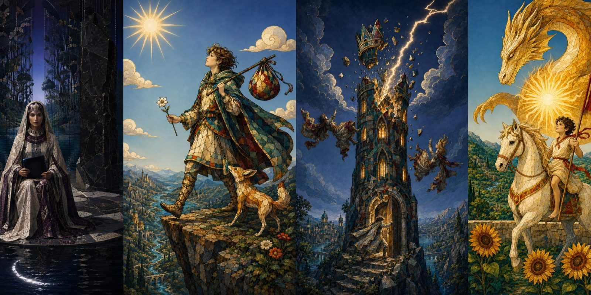{ .fh-illus .fh-banner }

Before the first die is cast, fate has already chosen a face for you. Every hero of Nymedes walks under one of the twenty-two Major Arcana — a patron, a burden, and a promise, drawn once and carried until destiny turns. Below is the full deck: each card with its meaning, its signature ability, its power, and the six Vibrations it can sing into your soul.

## Drawing a Major Arcana at character creation

At character creation, draw among the 22 Major Arcana to determine its influence on the character's fate: [Random Tarot Card Generator](https://randomtarotcard.com/Death.html).

> [!note] One Arcana at a time
> Only one Major Arcana is active at a time — there is no stacking of powers. When you draw a new Major Arcana (on a Major Awakening), you gain +1 to your **Destiny Score** and 10 temporary **Destiny Points** either way, then choose to:
> - **switch** to the new card — you lose the previous Arcana's powers and adopt the new one's, or
> - **keep** your current Arcana — the new card's powers are discarded.

Each Major Arcana provides:

- **Meaning** — a symbolic summary.
- **Signature Ability** — the card's ability score, read on *your* sheet: it is the spellcasting ability of the card's Vibrations (save DC = 8 + proficiency bonus + your modifier), and it names the Chaos table any Vibration drags you onto.
- **Destiny Impact** — a modifier to the initial Destiny score.
- **Power** — a regularly usable ability (like a racial trait).
- **Vibrations** — six stored one-shot effects, from rank 1 to 6. The full rules live in the Destiny System, §6: you gain one on an **Arcane Critical Success** with at least 1 Destiny Point, your **Destiny Score** sets the highest rank you can reach, and your **current Destiny Points** cap the total vp you can hold.

| Destiny Score | 1–3 | 4–6 | 7–10 | 11–15 | 16–20 | 21+ |
| --- | --- | --- | --- | --- | --- | --- |
| Max rank (vp) | 1 | 2 | 3 | 4 | 5 | 6 |

## Drawing in the whole tarot deck

On an **Arcane Awakening** (your Destiny Points reach 0 after a Natural 20), you draw from the whole tarot deck — all 78 cards, Major and Minor Arcana: [Random Tarot Card Generator](https://randomtarotcard.com/).

- **Minor Arcana** — gain temporary **Destiny Points** equal to the card's value (numbered cards give their number, Ace = 1; heads — Page, Knight, Queen, King — give 10), and a single **Brick**: not a power, but the chance to dream something into being. *(Full rule: [§5.1](fates-hand-mechanic.md#51-the-brick-dreaming-something-into-being).)*
- **Major Arcana** — +1 to your maximum **Destiny Score** and 10 temporary **Destiny Points** either way, then switch to the new card or keep your current one (see the Destiny System, §5).

## 0. The Fool

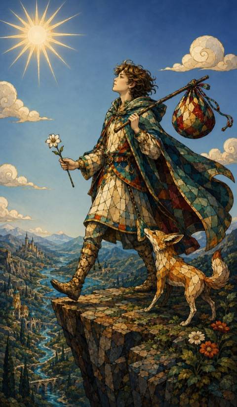{ .fh-thumb }

innocence, beginnings, carefreeness, freedom. Unlimited potential, stepping into the unknown without fear. Exploration without attachments, trust in chance.

[Read the full entry →](arcana/the-fool.md)

## I. The Magician

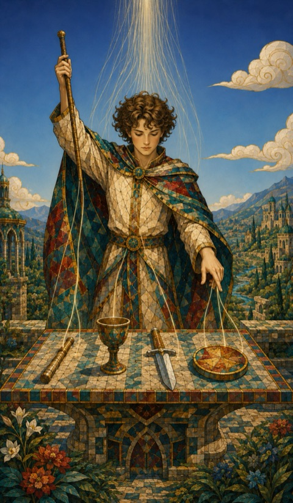{ .fh-thumb }

ingenuity, creativity, mastery of tools. The intellect shapes reality. The initiator of change through willpower.

[Read the full entry →](arcana/the-magician.md)

## II. The High Priestess

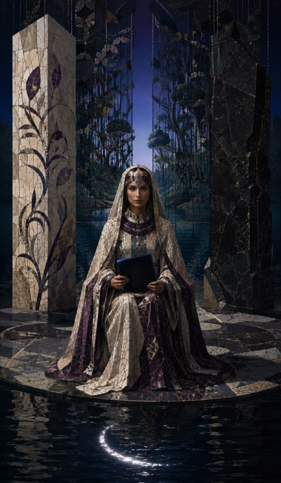{ .fh-thumb }

hidden knowledge, intuition, mystery. Inner wisdom, revelation through patient study. Silence and secrets of the soul.

[Read the full entry →](arcana/the-high-priestess.md)

## III. The Empress

{ .fh-thumb }

fertility, abundance, growth, prosperity. Support, harmony, generosity.

[Read the full entry →](arcana/the-empress.md)

## IV. The Emperor

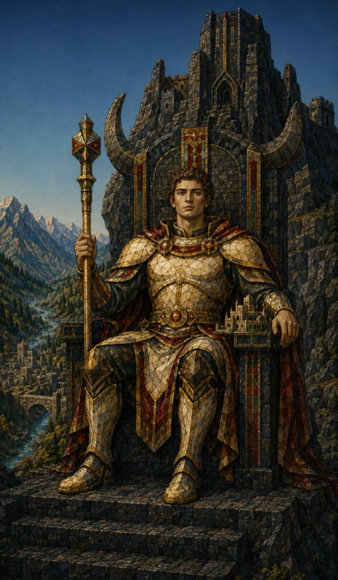{ .fh-thumb }

authority, order, stable power. Construction, organization, protection.

[Read the full entry →](arcana/the-emperor.md)

## V. The Hierophant

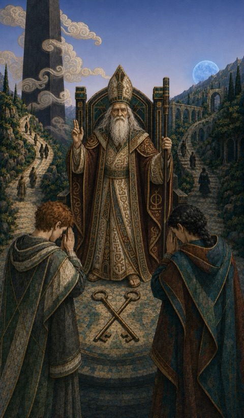{ .fh-thumb }

tradition, teaching, spiritual guidance. Faith, rituals, sacred order.

[Read the full entry →](arcana/the-hierophant.md)

## VI. The Lovers

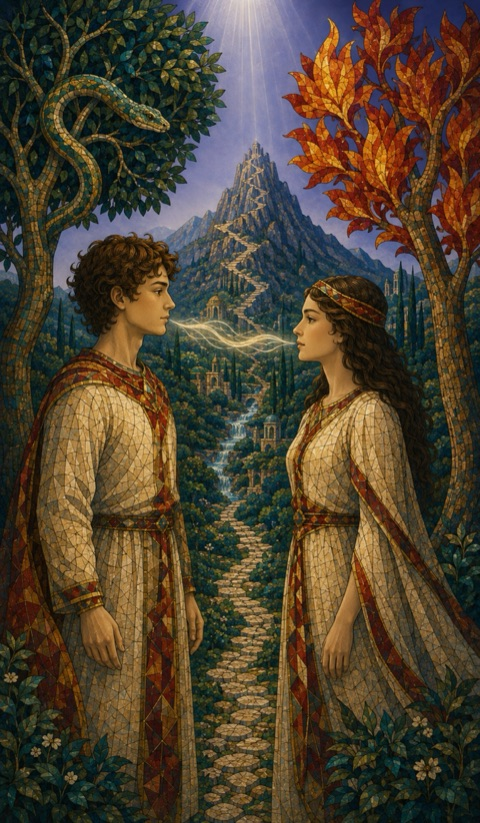{ .fh-thumb }

choice, harmony, relationships, moral dilemmas. Union, sacrifice, cooperation.

[Read the full entry →](arcana/the-lovers.md)

## VII. The Chariot

{ .fh-thumb }

victory, determination, triumph. Active control, moving toward success.

[Read the full entry →](arcana/the-chariot.md)

## VIII. Strength

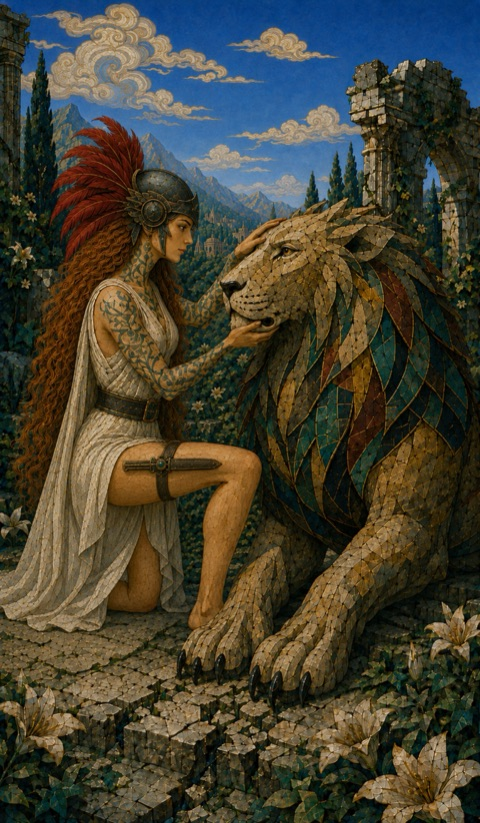{ .fh-thumb }

courage, mastery of instincts, perseverance, moral and physical endurance.

[Read the full entry →](arcana/strength.md)

## IX. The Hermit

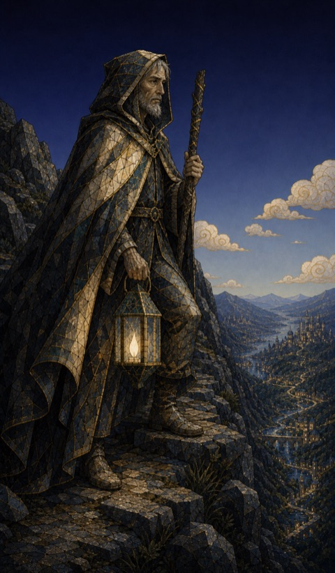{ .fh-thumb }

introspection, solitude, search for truth. Knowledge found in inner calm.

[Read the full entry →](arcana/the-hermit.md)

## X. Wheel of Fortune

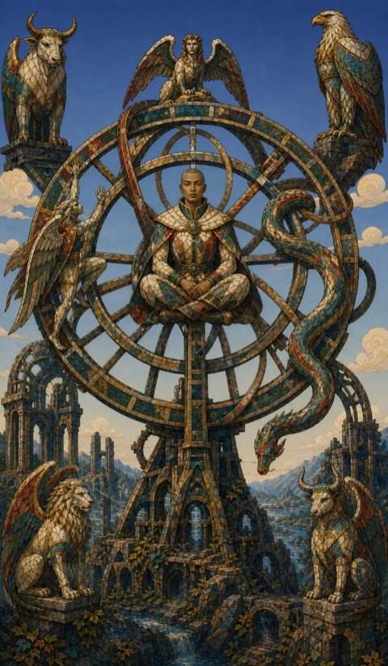{ .fh-thumb }

change, unstable destiny, opportunity, unpredictability. Embracing the cycle of ups and downs.

[Read the full entry →](arcana/wheel-of-fortune.md)

## XI. Justice

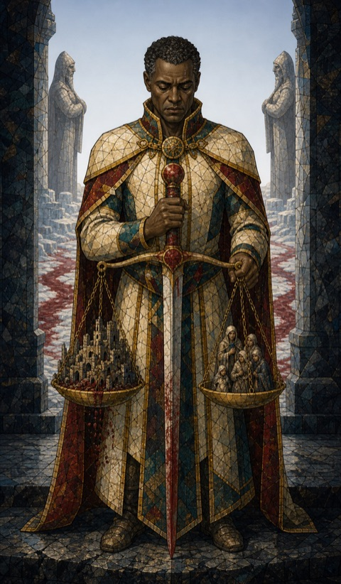{ .fh-thumb }

fairness, responsibility, moral order. Evaluating, assuming responsibility, restoring balance.

[Read the full entry →](arcana/justice.md)

## XII. The Hanged Man

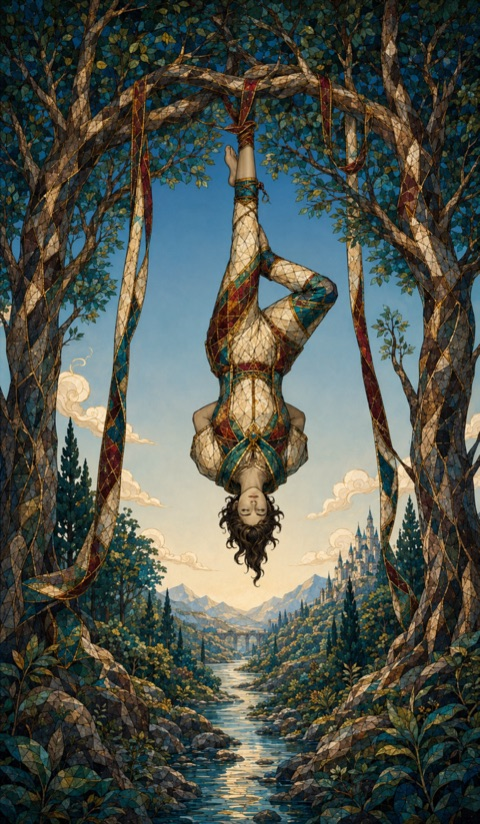{ .fh-thumb }

sacrifice, letting go, new perspective. Renouncing to gain understanding.

[Read the full entry →](arcana/the-hanged-man.md)

## XIII. Death

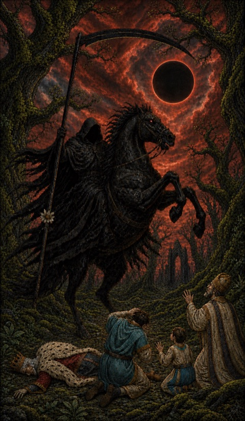{ .fh-thumb }

transformation, end of a cycle, rebirth. Radical change, not absolute finality.

[Read the full entry →](arcana/death.md)

## XIV. Temperance

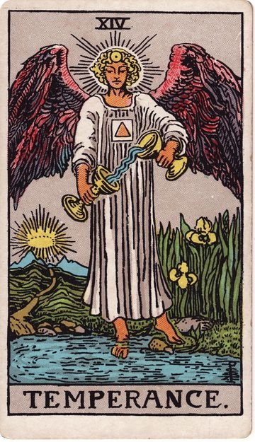{ .fh-thumb }

moderation, harmony, compromise. Finding balance and the right measure.

[Read the full entry →](arcana/temperance.md)

## XV. The Devil

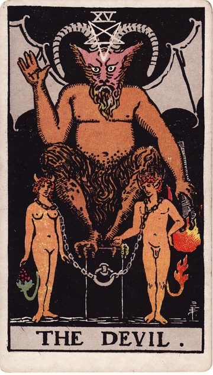{ .fh-thumb }

temptation, illusions, voluntary servitude. Power at the cost of freedom.

[Read the full entry →](arcana/the-devil.md)

## XVI. The Tower

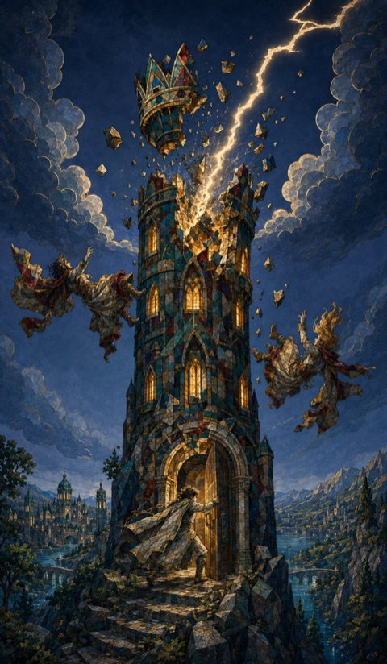{ .fh-thumb }

shock, collapse, brutal revelation. Destruction to rebuild on truth.

[Read the full entry →](arcana/the-tower.md)

## XVII. The Star

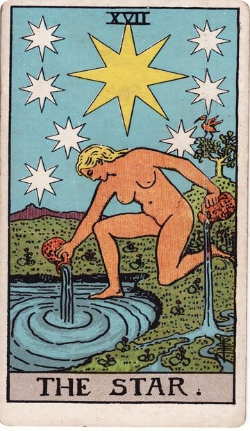{ .fh-thumb }

hope, inspiration, celestial guidance. A beacon in the night, trust in the future.

[Read the full entry →](arcana/the-star.md)

## XVIII. The Moon

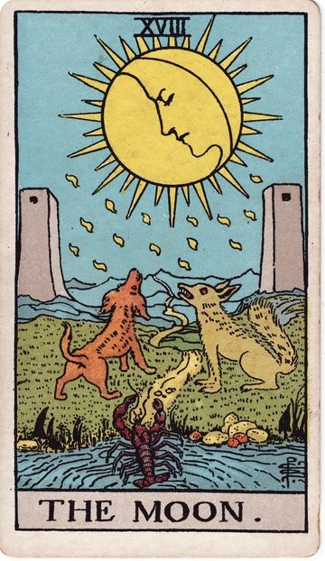{ .fh-thumb }

illusions, dreams, nocturnal mysteries. The unconscious mind, distorted perception.

[Read the full entry →](arcana/the-moon.md)

## XIX. The Sun

{ .fh-thumb }

success, vitality, clarity, joy. Dispels shadows, brings optimism and truth.

[Read the full entry →](arcana/the-sun.md)

## XX. Judgement

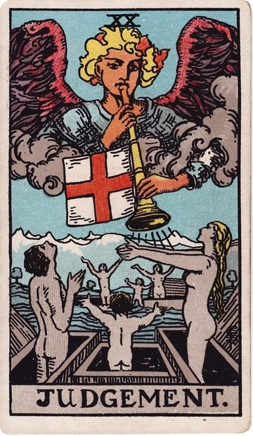{ .fh-thumb }

rebirth, higher calling, final reckoning. Weighing the past, offering redemption or judgment.

[Read the full entry →](arcana/judgement.md)

## XXI. The World

{ .fh-thumb }

accomplishment, wholeness, unity. The end of one cycle, opening to a new beginning.

[Read the full entry →](arcana/the-world.md)
