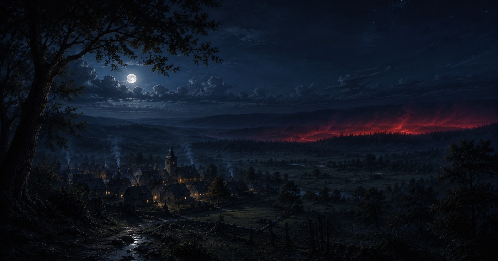

# Nymedes's Primordial Forces
*(Les Forces Primordiales de Nymedes — côté règles)*

The Third Age is shaped by Nymedes's two opposed primordial forces. This page holds their rules (in English); their lore lives in Les Forces Primordiales de Nymedes *(cosmologie)*. Each pocket varies in size, and may be conjured by a rite or arise on its own.

---

## Part 1 — The White Void
*(Le Blanc Néant — ÂNON)*

{ .fh-illus }

ÂNON's mist remakes the world through the dreams of the Awakened. Mechanically it is the world-facing side of an **Arcane Awakening** (full subsystem: [D&D 5+ Fate’s Hand Mechanic](fates-hand-mechanic.md)).

- **Trigger.** A character rolls a Natural 20 that brings their **Destiny Points** to 0 → an **Arcane Awakening**: they draw a Tarot card.
- **A Minor Arcana → a Brick.** The draw grants temporary **Destiny points** equal to the card's value (Ace = 1, heads give 10) and a **Brick** — not a power, but the chance to dream something into being. *(Full rule: [§5.1](fates-hand-mechanic.md#51-the-brick-dreaming-something-into-being).)*
- **Shaping the Brick = seeding a pocket of White Void.** The player owes a written story on the theme of the Arcana drawn, tied to their character's background and aspirations. The dream marks them: it surfaces as tattoos in the imagery of the story, and they feel the urge to tell it — because the dream is *so real*. That urge is the call of the White Void, and it grows stronger as time passes.
- **You incept it; you do not control it.** ÂNON's only power is the intuition that chooses *who* dreams — never the *when*, never the *what*.
- **The pocket's life-cycle.** Barrier (a white wall isolates a region) → displacement (what was there is relocated elsewhere on Nymedes) → recomposition (the dreamer's vision is drawn from the void) → fusion (the pocket merges with the world, permanent, and survives its dreamer). A pocket is not frozen: over time and further Awakenings it can shrink, vanish (if small) or transform (if vast).

> Full lore, the GM tables (what is recomposed / where the old land lands), and the canon cases (Atalante, Theymoron…) are in Les Forces Primordiales de Nymedes.

---

## Part 2 — The Crimson Shroud
*(Le Suaire Pourpre — Karagall)* 

{ .fh-illus }
Karagall's soul-devouring mist — the physical body of the Reaper (Arcane XV, The Devil), dissolved into bloody fog. A pocket may be raised from red sand by the *Conjure Minor / Major Crimson Shroud* rites ([Dark Rituals](dark-rituals.md)), or drift up on its own around inhabited land. Each pocket varies in size.

> [!warning] Effect of the Crimson Shroud — *identical at every potency, conjured or spontaneous*
> - **Limits.** It works only by night (22:00–05:00), cannot enter inhabited or warded places, and drifts toward the living — a small spontaneous pocket wanders on its own (20 ft/round); a conjured *Major* bank is steered by the casters. The mist is **heavily obscured** terrain.
> - **The harvest.** A creature that starts its turn in the mist — or enters it for the first time on a turn — makes a **Constitution** saving throw (DC 15). On a failure: 4d6 necrotic damage, and its hit point maximum is reduced by the amount taken until it finishes a long rest. On a success: half damage, no reduction. A sleeping or unconscious creature fails automatically — the mist comes for sleepers first.
> - **Soul-harvest.** A creature that drops to 0 hit points inside the mist dies instantly, its soul devoured by the Moisson: it cannot be raised, reincarnated, or resurrected by any means — the soul is simply gone.

**Souls for power.** The main casters may recover 1 **Destiny point** per soul harvested — but only for an ordinary (un-Awakened) soul. The soul of an **Awakened (Aberrant)** is not spent for raw Destiny; its power can only be taken by drinking it from a [Harvest Chalice](magic-items.md#harvest-chalice) (see *Drinking an Awakened soul* there).

> [!note] Stealing souls from the mist
> A [Harvest Chalice](magic-items.md#harvest-chalice) *(Calice de Moisson)* lets its bearer claim the souls of the dying inside the Crimson Shroud — seizing them before the Moisson devours them, to be banked and later drunk.

---

<nav class="fh-layer fh-layer--own">

<strong>Entirely Fate’s Hand.</strong> The base game says nothing about this subject — every rule on this page is Eric's.

</nav>