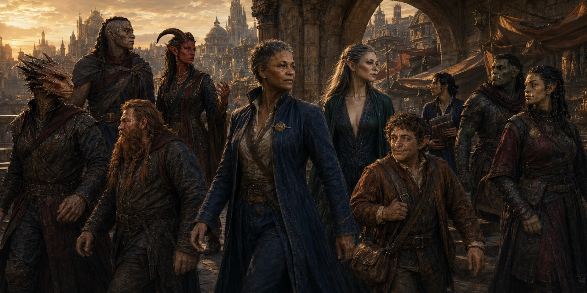
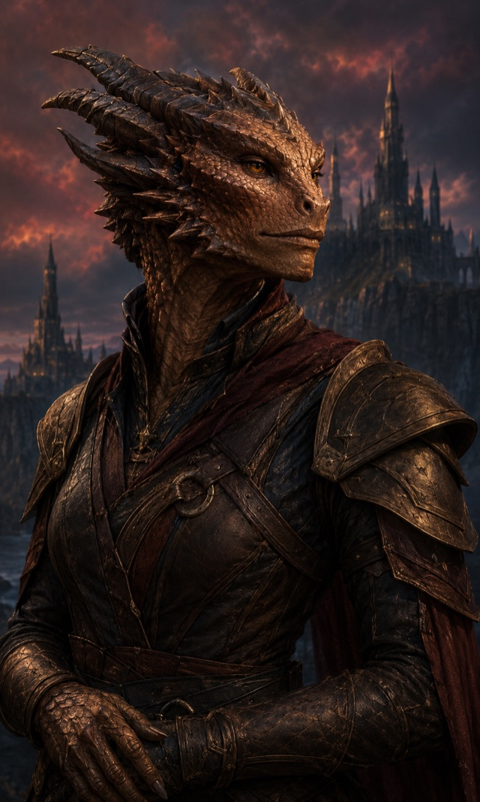
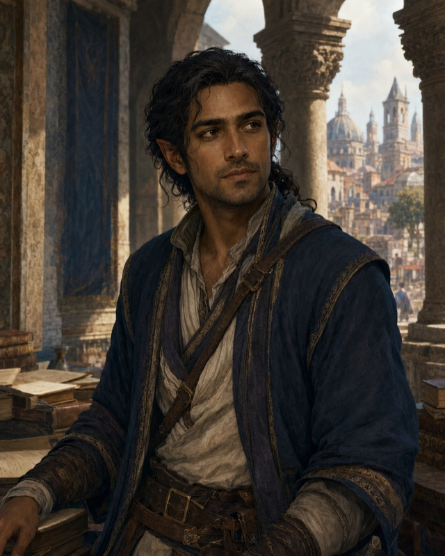
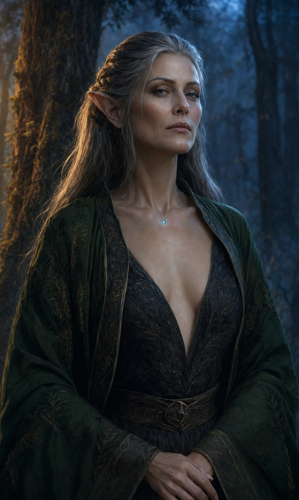
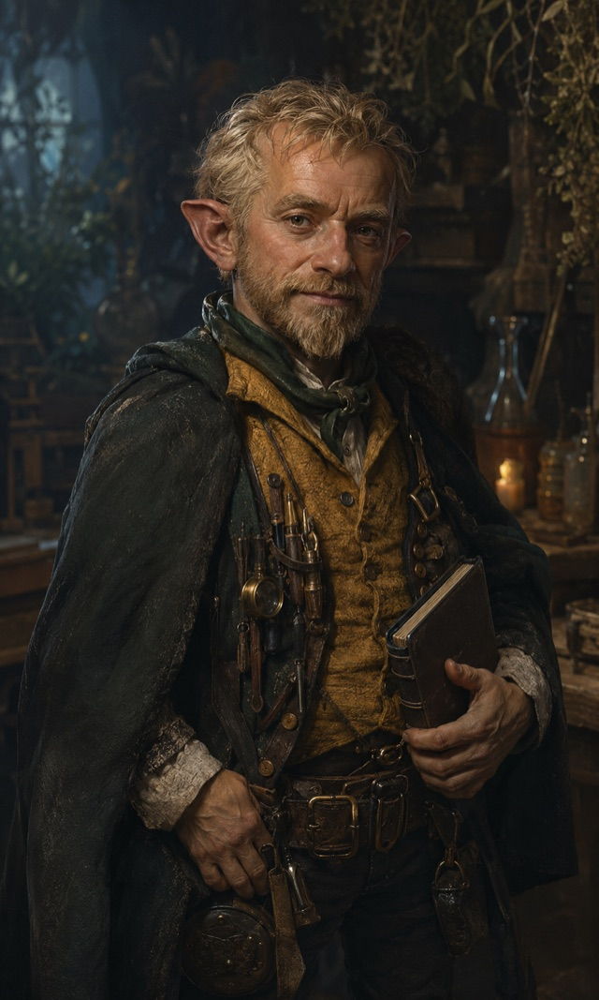
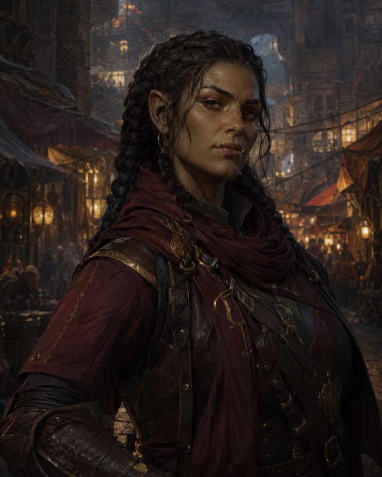

# Species

{ .fh-illus .fh-banner }

## The Species of Nymedes

Nymedes carries the familiar peoples of fantasy — and three of its own, born of the world's strange history: the **[Araags](#araag)**, fiend-marked children of the Harvest; the **[Loroka](#loroka)**, the demi-orc old blood of the Theymoron highlands; and the **[Elestu](#elestu)**, the rare demi-elves born of elven unions with humans or Araags.

> *"The continent is Araag — count the millions, then stop counting. The Loroka bend the terraces beside us; the dwarves keep their seams, the halflings their valleys; dragonborn, orcs and tieflings drift through our roads and our wars. Goliaths? A rumor of the far forests. The Hoddon? A rumor beneath the leaves — one the Empire still hunts. Humans are rare: a twice-born people the White Void handed back. And the elves and their Elestu children are so few that an archivist may serve three lifetimes and never see one."*
> — a census-keeper of Huitzlika

Species grant no ability modifiers — ability score increases come from your **Inheritance**. Every species speaks two languages (Common plus one of your choice) and keeps its standard speed.

## Araag

{ .fh-thumb }

Marked by the Harvest that unmade the last free humans, the Araags were once mistaken for tieflings — a resemblance that never sat easy with either people. They are common as dust within the Empire that shares their name, and stared at everywhere else: soul-touched, unmistakably other, and never quite trusted to explain why.

[Read the full entry →](species/araag.md)

## [Dragonborn](https://www.dndbeyond.com/species/1751435-dragonborn)

{ .fh-thumb }

Dragon-blooded wanderers whose scales mark them from birth as heirs to something older than any empire on Nymedes. Most trace their line to no living dragon at all — only to the breath that still wakes in their chest when they are cornered.

[Read the full entry →](species/dragonborn.md)

## [Dwarf](https://www.dndbeyond.com/species/1751436-dwarf)

{ .fh-thumb }

Stone-patient and clannish, the dwarves of Nymedes measure history in seams of ore rather than reigns of kings. Their halls survived the ages the surface did not; what they found down there, they rarely discuss with outsiders.

[Read the full entry →](species/dwarf.md)

## Elestu

{ .fh-thumb }

Children of scattered pairings between elves and humans — or elves and Araags — the Elestu are what an elven union actually bears: too mortal for the elves, too strange for everyone else. In Theymoron they gravitate to the university quarter and the Moonkeeper circles, and built their own quiet place between both worlds. Most end up bards, scholars, or both at once.

[Read the full entry →](species/elestu.md)

## [Elf](https://www.dndbeyond.com/species/1751437-elf)

{ .fh-thumb }

Elves are the only people of Nymedes who do not die of time. What they die of instead is everything else — a blade, a fall, a war — and so the elven number only ever falls. No elf has been born of two elves in living memory, nor in any memory an archive holds: elven unions bear nothing. Only a human or an Araag quickens an elven womb, and what comes of it is **Elestu** — a child who will grow old, and whose own children will be something else again. Every elf alive today was alive in the First Age.

[Read the full entry →](species/elf.md)

## [Goliath](https://www.dndbeyond.com/species/1751439-goliath)

{ .fh-thumb }

The goliaths of Nymedes are a people without a hearth. In the giant-ruled forests of the far north, the fire giants of Jaar hunt them for slaves and the hill giant hordes burn what little they build — so the Ghost Tribe sleeps in dug-out caches and forgotten ruins, moves like fog between the trees, and carries its history as scars and murmured songs rather than stone.

[Read the full entry →](species/goliath.md)

## [Halfling](https://www.dndbeyond.com/species/1751440-halfling)

{ .fh-thumb }

Small, unhurried, and hard to rattle — halfling communities tend to outlast the empires around them, quietly farming the same valley for a thousand years while dynasties rise and fall on the other side of the ridge. Luck, they'll tell you, is just what patience looks like from the outside.

[Read the full entry →](species/halfling.md)

## Hoddon

{ .fh-thumb }

Most people on Nymedes have never seen a Hoddon, and plenty insist nobody has. The little folk keep to hidden family-holds deep in the old forests, guarding what remains of the banned craft of the vanished humans — remnants the Empire of Huitzlika has hunted for centuries, and the Hoddon along with them. A Hoddon on the road is a rare thing: quiet, watchful, and carrying more forbidden knowledge than any imperial archive.

[Read the full entry →](species/hoddon.md)

## Human

{ .fh-thumb }

Humanity vanished from Nymedes at the end of the First Age — and a century ago, ten thousand souls walked back out of the White Void, refusing to vanish a second time. They are few, and everywhere talked about: their young cities rise fast and argue loudly — Theymoron's terraces, Dreideldorf's workshops, Atalante's harbors — as if noise could make up for numbers.

[Read the full entry →](species/human.md)

## Loroka

{ .fh-thumb }

The old blood of the Theymoron highlands — farmers, drovers and terrace-workers who worked these valleys long before the Marche had a name. Once the plurality of a conquered people, drawn heavily from the Sira low caste of the Empire, they are now the plurality of a free city: soldiers when the Front calls for it, but merchants, roofers and rice-growers the rest of the year.

[Read the full entry →](species/loroka.md)

## [Orc](https://www.dndbeyond.com/species/1751442-orc)

{ .fh-thumb }

The full-blooded kin of the Loroka, orcs endure where the land gives nothing back — hard plains, cold passes, borders nobody else wants. Their reputation for ferocity is mostly other people's word for stamina: an orc simply does not stop first.

[Read the full entry →](species/orc.md)

## Tiefling

{ .fh-thumb }

Fiend-touched by pact, curse or ancestry, tieflings are forever being mistaken for Araags — and correcting people, wearily, that their mark is older and came by a different road. Most learn young to be twice as charming as anyone expects, because they'll be trusted half as much.

[Read the full entry →](species/tiefling.md)

---

*This work includes material taken from the System Reference Document 5.2 ("SRD 5.2") by Wizards of the Coast LLC, available at [https://www.dndbeyond.com/srd](https://www.dndbeyond.com/srd). The SRD 5.2 is licensed under the Creative Commons Attribution 4.0 International License, available at [https://creativecommons.org/licenses/by/4.0/legalcode](https://creativecommons.org/licenses/by/4.0/legalcode). Portions of the SRD material — including the Elf, Human and other species — have been modified for this work.*
