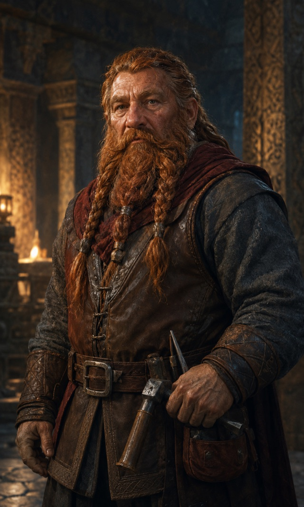

# [Dwarf](https://www.dndbeyond.com/species/1751436-dwarf)

{ .fh-portrait }

Stone-patient and clannish, the dwarves of Nymedes measure history in seams of ore rather than reigns of kings. Their halls survived the ages the surface did not; what they found down there, they rarely discuss with outsiders.

The reticence is not modesty. Dwarven halls came through the end of the First Age intact, and a people who kept their roof while the sky changed hands develops a particular view of everyone who did not. They are courteous about it. They are also, on the subject of what the deep tunnels connect to, entirely unhelpful — and the older the dwarf, the less helpful he becomes.

Above ground they are the steadiest thing in most cities that have them. A fifth of Theymoron is dwarven: masons, smiths, saddlers, the guilds that keep the terraces from sliding into the valley. They arrive early, they price honestly, and they keep a ledger of who owes what to whom that outlives the parties to it. Settle a debt cleanly with a dwarf and the friendship is inherited by your children. Fail to, and so is the grudge.

Not all of them are free. Under the fire giants' city of **Jaar**, in the far northern forests, dwarven slaves cut stone and sing revolt into the tunnels in a call-and-response no overseer has ever managed to ban outright — the songs sound like work. The Ghost Tribe goliaths who move through those woods will shelter a dwarven runaway, and do, and the two peoples have an understanding that neither writes down. Southern dwarven halls will tell you the tunnels of Jaar are a rumour. Runaways who reach them are given a bed, a name and no questions, which is not how one treats a rumour.

What they carry in the body matches what they carry in the temperament. Poison barely slows a dwarf down; eyes built for lightless seams see twice as far as anyone else's; and stone answers underfoot before an ambush announces itself. Dwarves consider none of this remarkable. It is simply what a person is, if the person has been paying attention for long enough.

**Traits**

**Creature type** Humanoid · **Size** Medium (about 4–5 feet tall) · **Speed** 30 feet

- **Darkvision** — 120 feet.
- **Dwarven Resilience** — resistance to Poison damage, and Advantage on saves to avoid or end the Poisoned condition.
- **Dwarven Toughness** — your hit point maximum increases by 1, and by 1 again at every level.
- **Stonecunning** — as a Bonus Action, gain Tremorsense 60 feet for 10 minutes while on a stone surface. Uses equal to your Proficiency Bonus, regained on a Long Rest.
- **Destiny** FH — Base 2.

*Base the base game text: [Dwarf](https://noirchicot.github.io/fh-srd/en/species/#dwarf)*

---

<nav class="fh-layer">

What Fate’s Hand does here

<ul>
<li>species adds 3 — Araag, Elestu, Loroka · changes 9 — Dragonborn, Dwarf, Elf, Goliath, Halfling, Hoddon… · replaces — Gnome → Hoddon</li>
</ul>

Measured against the base game’s data. Rules this chapter states in its own words are not counted here.

</nav>
