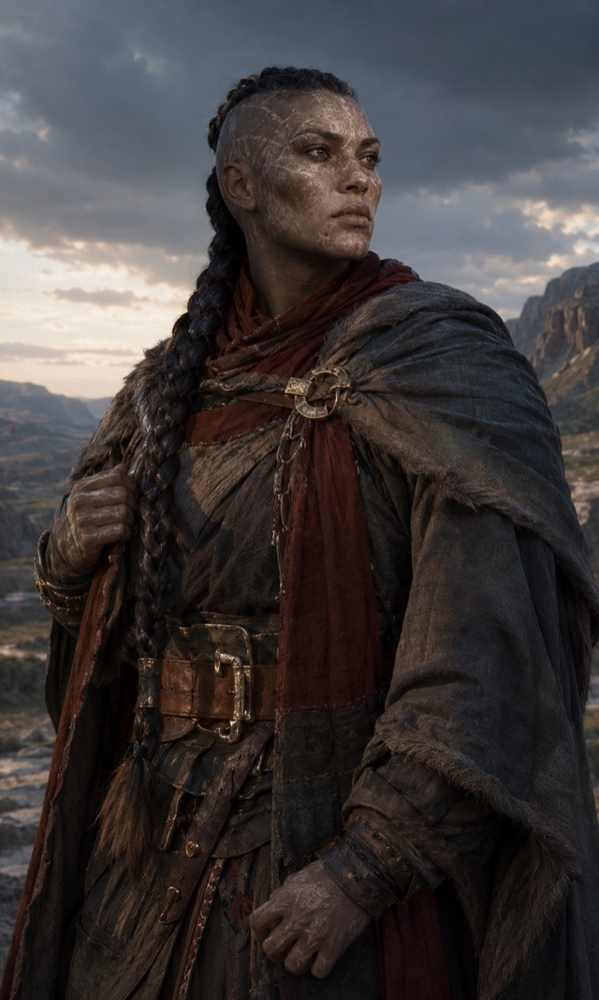

# [Goliath](https://www.dndbeyond.com/species/1751439-goliath)

{ .fh-portrait }

The goliaths of Nymedes are a people without a hearth. In the giant-ruled forests of the far north, the fire giants of Jaar hunt them for slaves and the hill giant hordes burn what little they build — so the Ghost Tribe sleeps in dug-out caches and forgotten ruins, moves like fog between the trees, and carries its history as scars and murmured songs rather than stone.

**Jotunskog** is the whole of the world to them: an infinite forest where light falls in gold shafts between ancient trunks, and where every clearing is a decision about how fast you could leave it. They travel at night. Morning mist drowns their tracks, which they take as the forest's collaboration and not as weather. The dead are remembered by recitation, because a name carved in stone is a name an enemy can find.

Their neighbours sort into three kinds and none of them are good. The **fire giants** of Jaar take goliaths for the forges, and their city is described by everyone who has seen it in the same two words: steel and suffering. The **hill giants** burn, loot and outnumber — even Jaar cannot hold them. The **stone giants** are the exception: hidden prophets who read the veins of rock, and who will trade a shelter or a warning for a story out of the forest. A goliath will tell you a stone giant's prophecy has never once been wrong and has never once been useful in time.

They are not alone under the canopy. Dwarven runaways out of Jaar's tunnels find their caches and are taken in. The forest's own spirits — born, they hold, from the death of the Green God — are given offerings at the sacred places, and on some nights are asked to look away from a theft or a kill taken in forbidden ground. Goliaths consider this an ordinary transaction between parties who both live here.

Every goliath met outside the north is a survivor of that long hunt. They are patient past the point where patience looks like slowness, they carry their scars where they can be seen, and they are building toward one thing they will name if you ask: a house in the light, with children in it who have never had to run.

**Traits**

**Creature type** Humanoid · **Size** Medium (about 7–8 feet tall) · **Speed** 35 feet

- **Giant Ancestry** — choose one boon from the table below; uses equal to your Proficiency Bonus, regained on a Long Rest.
- **Large Form** — at level 5, as a Bonus Action, become Large for 10 minutes: Advantage on Strength checks, and your Speed increases by 10 feet. Once per Long Rest.
- **Powerful Build** — Advantage on saves against the Grappled condition, and you count as one size larger for carrying capacity.
- **Destiny** FH — Base 2.

**Giant Ancestry**

| Boon | Effect |
|---|---|
| **Cloud's Jaunt** *(Cloud)* | Bonus Action: teleport up to 30 feet to a space you can see |
| **Fire's Burn** *(Fire)* | On a hit, deal an extra 1d10 Fire damage |
| **Frost's Chill** *(Frost)* | On a hit, deal an extra 1d6 Cold and reduce Speed by 10 feet |
| **Hill's Tumble** *(Hill)* | On a hit against a Large or smaller creature, knock it Prone |
| **Stone's Endurance** *(Stone)* | Reaction: roll 1d12 + Constitution modifier and reduce the damage |
| **Storm's Thunder** *(Storm)* | Reaction: deal 1d8 Thunder to a creature within 60 feet that damaged you |

*Base SRD text: [Goliath](https://noirchicot.github.io/fh-srd/en/species/#goliath)*

---

<nav class="fh-layer">

What Fate’s Hand does here

<ul>
<li>species adds 3 — Araag, Elestu, Loroka · changes 9 — Dragonborn, Dwarf, Elf, Goliath, Halfling, Hoddon… · replaces — Gnome → Hoddon</li>
</ul>

Measured against the SRD’s data. Rules this chapter states in its own words are not counted here.

</nav>
