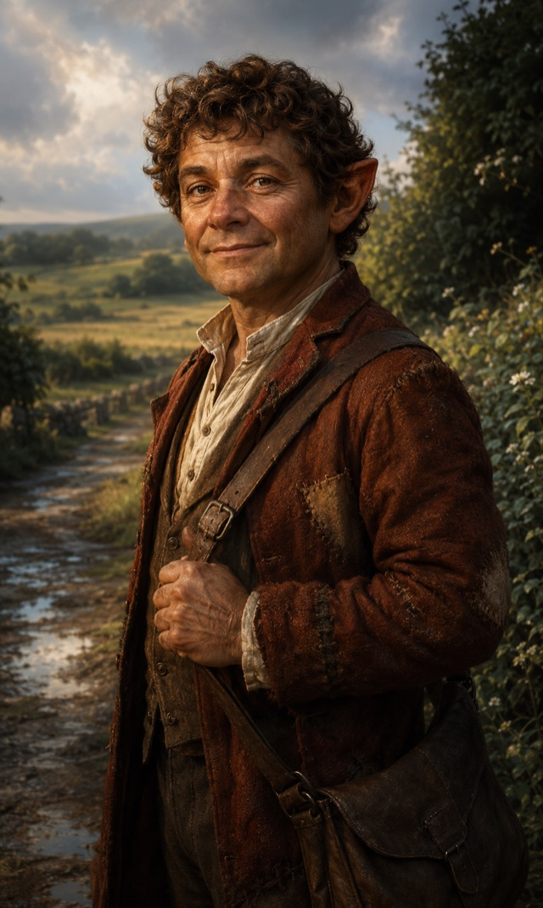

# [Halfling](https://www.dndbeyond.com/species/1751440-halfling)

{ .fh-portrait }

Small, unhurried, and hard to rattle — halfling communities tend to outlast the empires around them, quietly farming the same valley for a thousand years while dynasties rise and fall on the other side of the ridge. Luck, they'll tell you, is just what patience looks like from the outside.

The census-keeper of Huitzlika gives them one clause — *the halflings their valleys* — and moves on, which is exactly the outcome a halfling valley is organised to produce. They are not hidden. They are simply never the most interesting item on anyone's list. Armies have marched along the ridge road for four hundred years and taken nothing worth requisitioning, because there is never anything worth requisitioning, because the year an army is expected is a year of modest harvests and unremarkable barns.

Historians who have looked closely at the valleys report a puzzle they do not enjoy. The halfling settlements sit precisely where the wars are not. This is either the best siting instinct on the continent or a very long run of luck, and the archives cannot distinguish between the two. Halflings, asked, say it is patience — that anyone who stays somewhere long enough learns where not to build — and decline to be drawn further.

The Moonkeeper circles, which pay attention to this sort of thing, have a stranger reading. Fate's Hand falls oddly around halflings. Where a Chaos roll turns on most people, it hesitates on them: the disaster is a near miss, the collapse comes down on the empty side of the barn. There is no ritual behind it that anyone has found and no god claiming credit. It simply happens more often than it should, in a direction that favours them, and it has been happening since before the archives.

Halflings find the whole discussion faintly embarrassing. Their own account of themselves is domestic and complete: you are brave because someone has to be, you go where larger people cannot follow, and you reroll the bad throw because giving up on the first one is not a habit that gets a valley through a thousand years.

**Traits**

**Creature type** Humanoid · **Size** Small (about 2–3 feet tall) · **Speed** 30 feet

- **Brave** — Advantage on saving throws you make to avoid or end the Frightened condition.
- **Halfling Nimbleness** — you can move through the space of any creature larger than you.
- **Luck** — when you roll a 1 on the d20 of a D20 Test, you can reroll it, and you must use the new roll.
- **Naturally Stealthy** — you can take the Hide action while obscured only by a creature at least one size larger than you.
- **Destiny** FH — Base 2. **Outlasting** *(halfling chosen)*: Advantage on [Chaos rolls](../chaos-tables.md).

*Base the base game text: [Halfling](https://noirchicot.github.io/fh-srd/en/species/#halfling)*

---

<nav class="fh-layer">

What Fate’s Hand does here

<ul>
<li>species adds 3 — Araag, Elestu, Loroka · changes 9 — Dragonborn, Dwarf, Elf, Goliath, Halfling, Hoddon… · replaces — Gnome → Hoddon</li>
</ul>

Measured against the base game’s data. Rules this chapter states in its own words are not counted here.

</nav>
