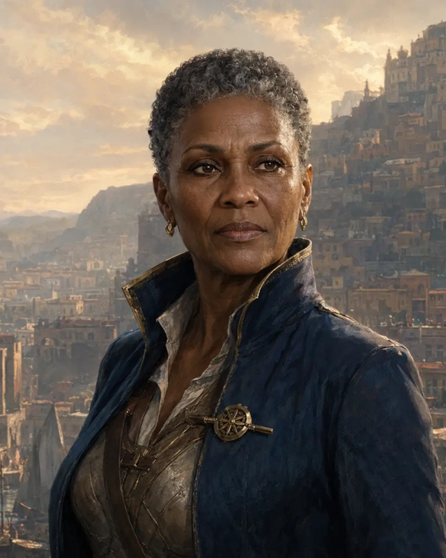

# uman

{ .fh-portrait }

Humanity vanished from Nymedes at the end of the First Age — and a century ago, ten thousand souls walked back out of the White Void, refusing to vanish a second time. They are few, and everywhere talked about: their young cities rise fast and argue loudly — Theymoron's terraces, Dreideldorf's workshops, Atalante's harbors — as if noise could make up for numbers.

Ten thousand is the whole of it. Every human on this world descends from that one crowd, and the crowd is within living memory: there are people alive who met someone who walked out. This does the human temperament no favours. They are a people with a founding generation instead of a mythology, and they will correct you about the details.

Nobody agrees on what happened. The Empire's archivists hold that the White Void gave them back, which is a formulation that carefully avoids saying gave them back as what. Human scholars in Theymoron prefer that nothing gave anything: that a people who refused to end simply took longer to finish arriving. The Moonkeeper circles decline to publish. What all three accounts share is the phrase the census-keeper of Huitzlika uses without elaborating — *a twice-born people* — and the fact that it is the humans themselves who like it least.

They compensate by building. Human quarters go up in a decade and are rebuilt twice in the next, because a human generation is short enough that waiting for consensus costs you the whole project. Their neighbours find them exhausting: loud in council, impatient with precedent, unwilling to concede that a thing has been tried. The Loroka, who have worked the same terraces for a thousand years, describe humans as visitors who started renovating.

What is not arguable is that they learn anything. Put a human beside a specialist of any other people and the human will be worse for a year and competent by the second. And the Hand favours them oddly — a human recovers what they have spent on fate faster than anyone, which the pious call a debt still being repaid, and which humans call a good night's sleep.

**Traits**

**Creature type** Humanoid · **Size** Medium (about 4–7 feet tall) or Small (about 2–4 feet tall), chosen when you select this species · **Speed** 30 feet

- **Skillful** FH — +2 [skill points](../skills-and-tools.md) at level 1, and that is all. *(The base game grants one skill proficiency; Fate's Hand converts every level-1 grant into pool points.)*
- **Versatile** — you gain an Origin feat of your choice.
- **Destiny** FH — Base 2. **Twice-Born** *(human chosen)*: recover 2 Destiny Points per Long Rest instead of one.

*Base the base game text: [Human](https://noirchicot.github.io/fh-srd/en/species/#human)*

---

<nav class="fh-layer">

What Fate’s Hand does here

<ul>
<li>species adds 3 — Araag, Elestu, Loroka · changes 9 — Dragonborn, Dwarf, Elf, Goliath, Halfling, Hoddon… · replaces — Gnome → Hoddon</li>
</ul>

Measured against the base game’s data. Rules this chapter states in its own words are not counted here.

</nav>
