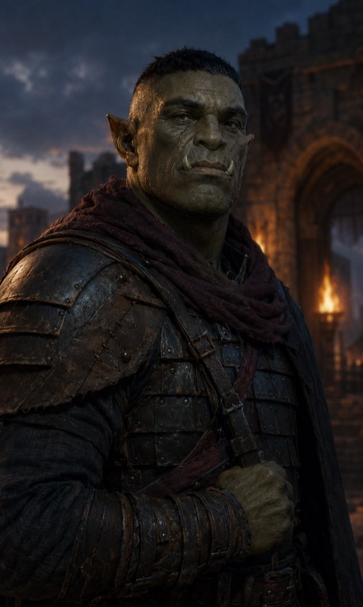

# [Orc](https://www.dndbeyond.com/species/1751442-orc)

{ .fh-portrait }

The full-blooded kin of the Loroka, orcs endure where the land gives nothing back — hard plains, cold passes, borders nobody else wants. Their reputation for ferocity is mostly other people's word for stamina: an orc simply does not stop first.

That distinction matters more than it sounds. An orc war-band is not notably more violent than anyone else's; it is still marching on the fourth day. Imperial commanders who have faced them write the same sentence in different decades — that the engagement was won and the orcs were still there in the morning. Nothing about this is mystical. It is a body that keeps going past the point where the decision to keep going has been made.

They hold the ground nobody contests, which is the same as saying they hold the ground nobody can farm. Orc country is passes, high plains and the wrong side of a watershed, and it is theirs because two empires looked at it and declined. Orcs are entirely aware of how they came by it. They also point out, correctly, that a people who can live there cannot be starved out of anywhere else.

Their neighbours cannot decide whether they are one people or two. The Loroka of Theymoron are their kin and their opposite number: the same blood settled on terraces, gone to market, and gone respectable. Orcs and Loroka trade constantly, marry occasionally, and each regard the other as the branch that made the wrong call. It is not a feud. It is closer to the way brothers discuss an inheritance, indefinitely.

The census-keeper of Huitzlika lists them with the dragonborn and tieflings as peoples who *drift through our roads and our wars*, which orcs would consider a misreading. They do not drift. They are hired — for the passes, for the winter columns, for any work where the difference between competent and finished is whether someone was still upright on the fourth day. Then they go home, to country that gives nothing back, and get on with it.

**Traits**

**Creature type** Humanoid · **Size** Medium (about 6–7 feet tall) · **Speed** 30 feet

- **Darkvision** — 120 feet.
- **Adrenaline Rush** — take the Dash action as a Bonus Action and gain temporary hit points equal to your Proficiency Bonus. Uses equal to your Proficiency Bonus, regained on a Short or Long Rest.
- **Relentless Endurance** — when you drop to 0 hit points and don't die outright, you can drop to 1 instead. Once per Long Rest.
- **Destiny** FH — Base 2.

*Base SRD text: [Orc](https://noirchicot.github.io/fh-srd/en/species/#orc)*

---

*This work includes material taken from the System Reference Document 5.2 ("SRD 5.2") by Wizards of the Coast LLC, available at [https://www.dndbeyond.com/srd](https://www.dndbeyond.com/srd). The SRD 5.2 is licensed under the Creative Commons Attribution 4.0 International License, available at [https://creativecommons.org/licenses/by/4.0/legalcode](https://creativecommons.org/licenses/by/4.0/legalcode). Portions of the SRD material — including the Elf, Human and other species — have been modified for this work.*
