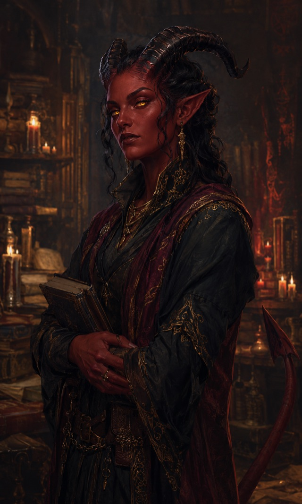

# Tiefling

{ .fh-portrait }

Fiend-touched by pact, curse or ancestry, tieflings are forever being mistaken for Araags — and correcting people, wearily, that their mark is older and came by a different road. Most learn young to be twice as charming as anyone expects, because they'll be trusted half as much.

The confusion is not stupidity on anyone's part. On a continent where the largest people alive is visibly soul-touched, a horned stranger reads as Araag first and everything else second, and the correction has to be made at every gate, every inn and every hiring. Tieflings make it. They also stop making it, eventually, in places where it does not help — which is how a good many end up counted as Araag in imperial rolls, to the irritation of both peoples.

Their own account puts the mark before the Harvest, not after it. Where an Araag was made by something that happened to a whole people within recorded history, a tiefling inherits from a bargain, a curse or a bloodline whose original party is long past arguing about the terms. This is a distinction of some pride and no practical value. The census-keeper of Huitzlika files them with the dragonborn and the orcs — peoples who *drift through our roads and our wars* — and does not distinguish the three roads by which they arrived.

What the legacy actually grants is narrower than the rumour. A tiefling of the Abyssal line shrugs off poison; a Chthonic one, the rot; an Infernal one, fire — and each carries a thin thread of spells that widens twice in a career and then stops. It is not sorcery. It is a family resemblance that happens to be measurable, and tieflings who wanted more of it have generally had to go and study like everyone else.

So they arrive charming, because the alternative is arriving unemployed. The habit is deep enough that other peoples mistake it for the character rather than the armour. Tieflings do not usually correct that one. It is the first thing in the conversation that has ever worked in their favour.

**Traits**

**Creature type** Humanoid · **Size** Medium (about 4–7 feet tall) or Small (about 3–4 feet tall), chosen when you select this species · **Speed** 30 feet

- **Darkvision** — 60 feet.
- **Fiendish Legacy** — choose a legacy from the table below; you gain its level 1 benefit. At character levels 3 and 5 you learn the listed spell, always prepared, castable once without a slot per Long Rest, or with any slot of the appropriate level. Intelligence, Wisdom or Charisma is your spellcasting ability for this trait (chosen with the legacy).
- **Otherworldly Presence** — you know the *Thaumaturgy* cantrip.
- **Destiny** FH — Base 2.

**Fiendish Legacies**

| Legacy | Level 1 | Level 3 | Level 5 |
|---|---|---|---|
| **Abyssal** | Resistance to Poison damage; you know *Poison Spray* | *Ray of Sickness* | *Hold Person* |
| **Chthonic** | Resistance to Necrotic damage; you know *Chill Touch* | *False Life* | *Ray of Enfeeblement* |
| **Infernal** | Resistance to Fire damage; you know *Fire Bolt* | *Hellish Rebuke* | *Darkness* |

*Base the base game text: [Tiefling](https://noirchicot.github.io/fh-srd/en/species/#tiefling)*

---

*This work includes material taken from the System Reference Document 5.2 ("SRD 5.2") by Wizards of the Coast LLC, available at [https://www.dndbeyond.com/srd](https://www.dndbeyond.com/srd). The SRD 5.2 is licensed under the Creative Commons Attribution 4.0 International License, available at [https://creativecommons.org/licenses/by/4.0/legalcode](https://creativecommons.org/licenses/by/4.0/legalcode). Portions of the SRD material — including the Elf, Human and other species — have been modified for this work.*

---

<nav class="fh-layer">

What Fate’s Hand does here

<ul>
<li>species adds 3 — Araag, Elestu, Loroka · changes 9 — Dragonborn, Dwarf, Elf, Goliath, Halfling, Hoddon… · replaces — Gnome → Hoddon</li>
</ul>

Measured against the base game’s data. Rules this chapter states in its own words are not counted here.

</nav>
