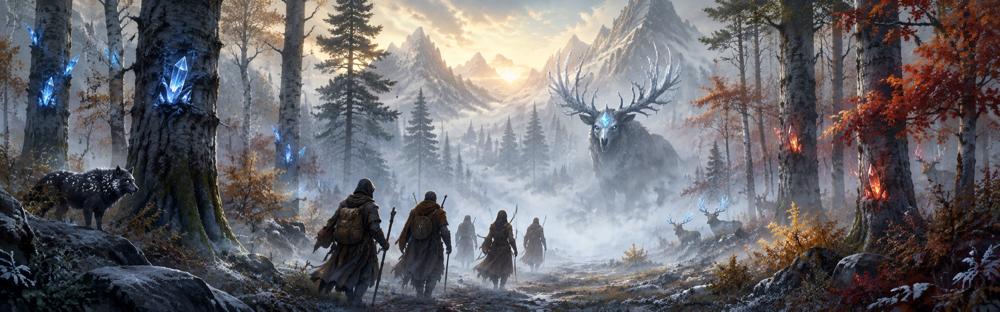

---
hide:
  - navigation
  - toc
---

{ .fh-banner }

# Fate's Hand

A Player's Handbook for the Fate's Hand 5+ house rules — an expansion of **D&D 2024**.

> *"There are more worlds than you know. Tread carefully, lest you rouse the powers that shape them."*

Fate's Hand keeps everything you know from D&D 2024 and layers three things on top:

- **A wider skill system** — 26 skills (Perception split into Delve / Survival / Vigilance) with **tools folded into the same point pool**.
- **The Fate's Hand mechanic** — a **Destiny Score** and **Destiny Dice** that bend fate at a price, with **Chaos** when you overreach.
- **The Major Arcana** — a tarot-drawn destiny granting a signature power.

…plus tightened rules for **combat, grappling, feats and exploration**.

-   :material-account-plus:{ .lg .middle } &nbsp;**Creating a Character**

    ---

    Build a character step-by-step: ability scores, species, skills & tools, feats.

    [:octicons-arrow-right-24: Start building](chapters/ability-scores.md)

-   :material-sword-cross:{ .lg .middle } &nbsp;**Playing the Game**

    ---

    The systems you use at the table: skills & synergies, the Destiny mechanic, battlefield rules.

    [:octicons-arrow-right-24: Learn to play](chapters/skills-synergies.md)

-   :material-cards-playing:{ .lg .middle } &nbsp;**The Major Arcana**

    ---

    Draw your destiny — 22 cards, each with its own power and vibration.

    [:octicons-arrow-right-24: Read the cards](chapters/major-arcana.md)

-   :material-calculator-variant:{ .lg .middle } &nbsp;**Skill-Point Builder**

    ---

    Distribute your skill & tool points interactively, then export to D&D Beyond.

    [:octicons-arrow-right-24: Open the builder](builder.md)

!!! note "Base rules"
    Anything not changed here works exactly as in **D&D 2024**. This handbook only documents the **Fate's Hand** differences. **📖** markers flag the *complex* skills/tools.
