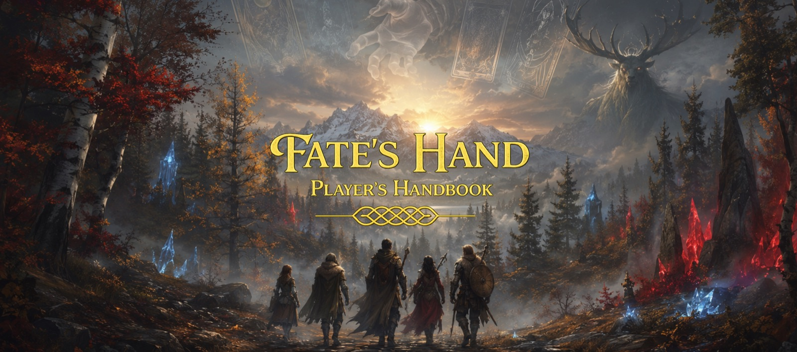
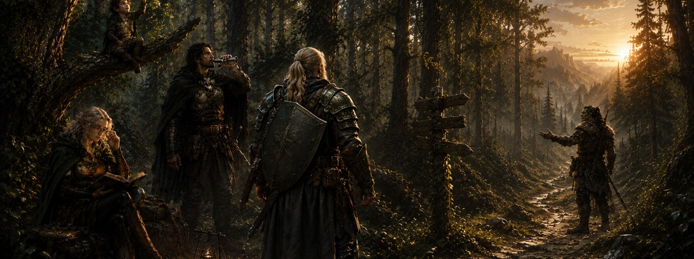
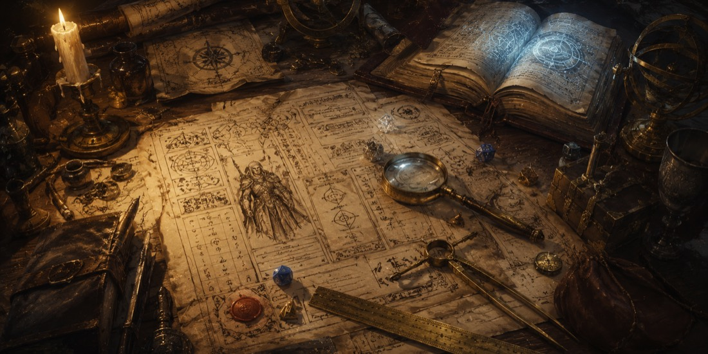
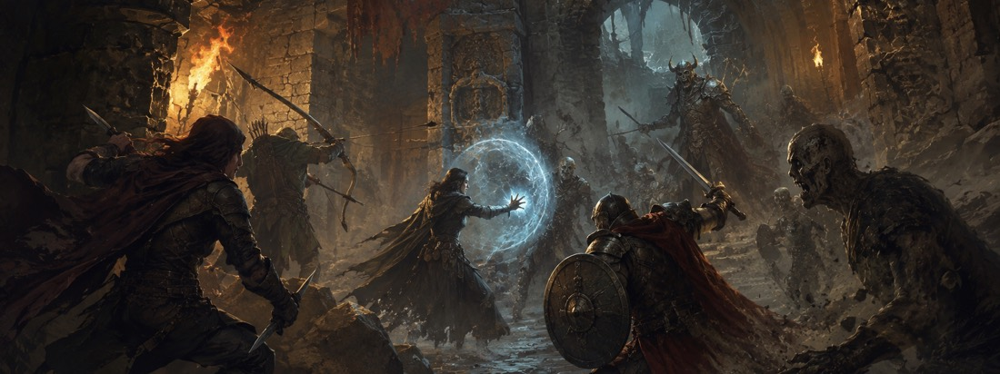

---
hide:
  - navigation
  - toc
---

<a class="fh-dm-button" href="gm.html" title="Open DM Control">DM</a>

{ .fh-banner }

# Fate's Hand — Player's Handbook { .fh-cover-title }

House rules for the Fate's Hand 5+ system — an expansion of **D&D 2024**.

A fast rules reference at the table, a guided character builder, and one compact place for the Fate's Hand systems that D&amp;D Beyond does not track.

<a class="fh-home-action fh-home-action--gold" href="skill-builder.html">
  ✦
  <b>Create a character</b><small>Guided level 1 builder</small>
</a>

<a class="fh-home-action fh-home-action--red" href="player/">
  ⚔
  <b>Open Player Companion</b><small>Character · inventory · Soulforge</small>
</a>

<a class="fh-home-action" href="#rules-reference">
  ⌕
  <b>Browse the rules</b><small>Short chapters, searchable</small>
</a>

<section class="fh-difference" aria-labelledby="fh-difference-title">
  
THE 5+ LAYER

  <h2 id="fh-difference-title">What makes Fate's Hand different?</h2>
  

    
<b>More ways to be skilled</b>Expanded skills, tools, expertise and synergies.

    
<b>Destiny matters</b>Spend, recover and risk Destiny when the moment turns.

    
<b>Arcana shape characters</b>A Major Arcana gives every hero a distinct thread of fate.

    
<b>Monsters become gear</b>Identify, harvest, prepare and Soulforge what you defeat.

  

</section>

## Rules Reference { #rules-reference .fh-section-title }

Everything is grouped by the question a player is trying to answer — not by where the rule happens to live.

-   Build a Character

    - [**Guided Character Builder**](skill-builder.html){ .fh-hot }
    - [Rolling Ability Scores](chapters/ability-scores.md)
    - [Species](chapters/species.md)
    - [Backgrounds](chapters/backgrounds.md)
    - [Skills & Tools](chapters/skills-and-tools.md)
    - [Feats](chapters/feats.md)
    - [Class Modifications](chapters/classes.md)
    - [Moonkeeper](chapters/moonkeeper.md)

-   At the Table

    - [**Player Companion**](player.md){ .fh-hot }
    - [Party Inventory](inventory.md)
    - [Soulforge Workshop](soulforge.md)
    - [Skills & Synergies](chapters/skills-synergies.md)
    - [Battlefield](chapters/battlefield.md)
    - [Dungeoneering](chapters/dungeoneering.md)

-   Destiny &amp; Chaos

    - [Destiny System](chapters/fates-hand-mechanic.md)
    - [Major Arcana](chapters/major-arcana.md)
    - [Chaos Tables](chapters/chaos-tables.md)

-   Magic &amp; Soulforging

    - [New Spells](chapters/spells.md)
    - [Dark Rituals](chapters/dark-rituals.md)
    - [Circle Magic](chapters/circle-magic.md)
    - [Soulforging Rules](chapters/soulforge-crafting.md)
    - [Magic Items](chapters/magic-items.md)

-   Core Rule Changes

    - [Skills & Tools](chapters/skills-and-tools.md)
    - [Synergies](chapters/skills-synergies.md)
    - [Combat & Battlefield](chapters/battlefield.md)
    - [Exploration](chapters/dungeoneering.md)

-   World

    - [Primordial Forces](chapters/primordial-forces.md)

    *More to come — the lands, moons and powers of Fate's Hand.*

